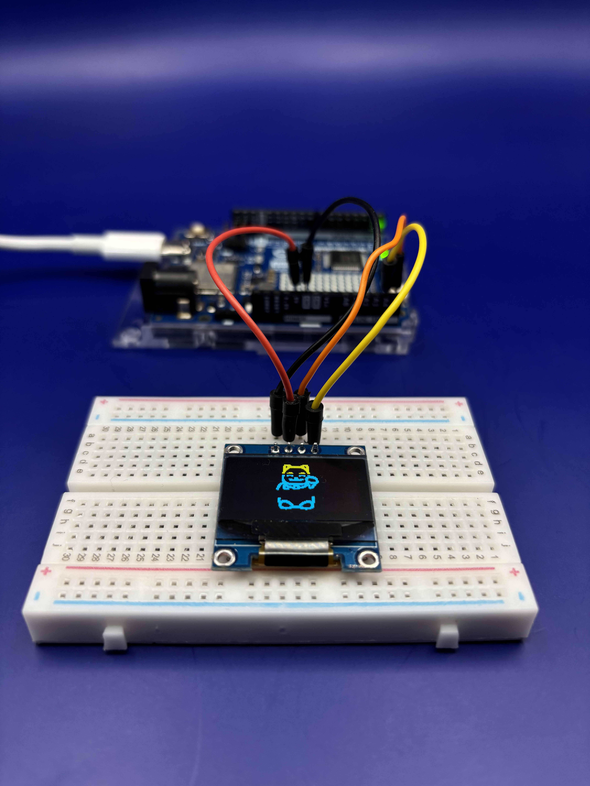

# grupo-01

## integrantes

* Sofía Cartes Aravena / <https://github.com/sofiacartes>
* Monserrat Paredes / <https://github.com/Monserrat-Paredes>
* Valentina Ruz Pizarro / <https://github.com/vxlentiinaa>

## descripción del proyecto

Nuestro proyecto se basa en el desarrollo de un sistema de interacción inalámbrica entre un microcontrolador Arduino y la plataforma en la nube/web Adafruit IO, con el objetivo de controlar dispositivos de manera remota a través de la misma conexión (internet). 

Por un lado, el Arduino es capaz de almacenar datos, en este caso si el botón está encendido o apagado, y enviarlos en tiempo real hacia Adafruit IO utilizando conexión a internet. Estos datos son almacenados y controlados en un dashboards personalizado dentro de la plataforma Adafruit. El proyecto permite el control remoto del Arduino desde Adafruit IO, a través de elementos interactivos como el botón de on/off dentro del dashboard que Arduino recibe; activando y desactivando la pantalla Oled, donde esta muestra un pictograma de gatito saludando, y cuando aprietes el off, el gatito desaparece.

## materiales usados en solemne-01

|Componente|Cantidad|Precio|Link|
|---|---|---|---|
|Pantalla Oled SS1306|1|$4.500|<https://afel.cl/products/pantalla-lcd-oled-azul-y-amarillo-0-96>|
|Arduino UNO R4 WIFI|1|$38.990|<https://mcielectronics.cl/shop/product/arduino-uno-r4-minima>|
|Protoboard|1|$1.500|<https://afel.cl/products/mini-protoboard-400-puntos>|
|cables|4|$1.000|<https://afel.cl/products/pack-20-cables-de-conexion-macho-macho>|

## código usado con Adafruit IO

> En este código lo que hicimos fue incluir la pantalla OLED SS1306 con una animación/pictograma sacado de [WOKWI](https://animator.wokwi.com/)
> Donde definimos el tamaño de la pantalla y una variable en el feed de Adafruit. En este caso, utilizamos un botón en los dashboards de Adafruit para prender y apagar la pantalla Oled desde otro computador; y que en esta salga la animación dependiendo de si está prendida. 

```cpp
// Adafruit IO Publish Example
//
// Adafruit invests time and resources providing this open source code.
// Please support Adafruit and open source hardware by purchasing
// products from Adafruit!
//
// Written by Todd Treece for Adafruit Industries
// Copyright (c) 2016 Adafruit Industries
// Licensed under the MIT license.
//
// All text above must be included in any redistribution.

// ejemplo para enviar / publish
// por montoyamoraga
// para disenoUDP
// basado en
// Adafruit IO Publish Example

// incluir archivo config.h
// hacer las modificaciones de este archivo
// NO subir a github
#include "config.h"

// librerias para pantalla oled
#include <Wire.h>
#include <Adafruit_GFX.h>
#include <Adafruit_SSD1306.h>

// definir tamaño de la pantalla
#define SCREEN_I2C_ADDR 0x3C
#define SCREEN_WIDTH 128
#define SCREEN_HEIGHT 64
#define OLED_RST_PIN -1

Adafruit_SSD1306 display(SCREEN_WIDTH, SCREEN_HEIGHT, &Wire, OLED_RST_PIN);

// definir una variable que se llame nombreFeed
// el feed es de Adafruit IO
AdafruitIO_Feed *grupo01 = io.feed("grupo01");

// estado del botón en Adafruit
bool oledEncendida = false;

// pictograma de gatito cute de wokwi
#define FRAME_DELAY (42)
#define FRAME_WIDTH (64)
#define FRAME_HEIGHT (64)
#define FRAME_COUNT (sizeof(frames) / sizeof(frames[0]))

const byte PROGMEM frames[][512] = {
  {0,0,0,0,0,0,0,0,0,0,0,0,0,0,0,0,0,0,0,0,0,0,0,0,0,0,31,192,1,248,0,0,0,0,31,224,7,248,0,0,0,0,59,255,255,188,0,0,0,0,57,255,255,156,0,0,0,0,59,255,255,220,0,0,0,0,63,128,3,252,0,0,0,0,63,0,0,252,0,0,0,0,62,0,0,124,240,0,0,0,60,0,0,63,252,0,0,0,56,0,0,31,254,0,0,0,56,0,0,30,30,0,0,0,112,240,7,156,7,0,0,0,115,248,31,204,7,0,0,0,115,248,31,207,3,0,0,0,115,24,24,207,231,0,0,0,96,0,0,7,255,0,0,0,96,3,192,7,254,0,0,0,96,3,192,6,30,0,0,0,96,243,239,6,14,0,0,0,112,127,255,14,14,0,0,0,112,127,252,14,30,0,0,0,120,0,0,30,28,0,0,0,60,0,0,60,28,0,0,0,127,0,0,124,60,0,0,1,255,255,255,252,56,0,0,3,255,255,255,252,120,0,0,7,158,255,254,126,112,0,0,7,63,7,224,254,240,0,0,15,63,231,243,231,224,0,0,14,59,254,127,199,224,0,0,14,57,254,127,7,128,0,0,28,63,15,240,3,0,0,0,28,31,135,224,3,128,0,0,12,7,195,192,3,128,0,0,12,1,224,0,1,128,0,0,14,0,224,0,1,192,0,0,14,0,224,0,1,192,0,0,7,0,224,0,1,192,0,0,7,128,224,0,0,192,0,0,7,225,224,0,0,192,0,0,7,255,192,0,0,224,0,0,7,255,128,0,0,224,0,0,7,28,0,0,0,224,0,0,7,0,0,0,0,224,0,0,7,0,0,0,0,224,0,0,7,0,0,0,0,224,0,0,6,0,0,0,0,224,0,0,7,126,0,0,62,224,0,0,7,255,128,0,255,224,0,0,7,255,192,3,255,224,0,0,3,195,224,7,195,192,0,0,3,128,240,15,1,192,0,0,3,128,120,30,1,192,0,0,3,128,56,28,1,192,0,0,3,128,31,248,1,192,0,0,1,224,127,254,3,192,0,0,1,255,255,255,255,128,0,0,0,255,224,15,254,0,0,0,0,4,0,0,96,0,0,0,0,0,0,0,0,0,0,0,0,0,0,0,0,0,0},
  {0,0,0,0,0,0,0,0,0,0,0,0,0,0,0,0,0,0,0,0,0,0,0,0,0,0,31,192,1,248,0,0,0,0,31,224,7,248,0,0,0,0,59,255,255,188,0,0,0,0,57,255,255,156,0,0,0,0,59,255,255,220,0,0,0,0,63,128,3,252,0,0,0,0,63,0,0,252,0,0,0,0,62,0,0,124,192,0,0,0,60,0,0,63,248,0,0,0,56,0,0,31,252,0,0,0,56,0,0,30,30,0,0,0,112,240,7,158,15,0,0,0,115,248,31,220,7,0,0,0,115,248,31,206,3,0,0,0,115,24,24,207,199,0,0,0,96,0,0,7,255,0,0,0,96,3,192,7,255,0,0,0,96,3,192,6,62,0,0,0,96,243,239,6,14,0,0,0,112,127,255,14,14,0,0,0,112,127,252,14,28,0,0,0,120,0,0,30,28,0,0,0,60,0,0,60,28,0,0,0,127,0,0,124,60,0,0,1,255,255,255,252,56,0,0,3,255,255,255,252,120,0,0,7,158,255,254,126,112,0,0,7,63,7,224,254,240,0,0,15,63,231,243,231,224,0,0,14,59,254,127,199,192,0,0,14,57,254,127,7,128,0,0,28,63,15,240,3,0,0,0,28,31,135,224,3,128,0,0,12,7,195,192,3,128,0,0,12,1,224,0,1,128,0,0,14,0,224,0,1,192,0,0,14,0,224,0,1,192,0,0,7,0,224,0,1,192,0,0,7,128,224,0,0,192,0,0,7,225,224,0,0,192,0,0,7,255,192,0,0,224,0,0,7,255,128,0,0,224,0,0,7,28,0,0,0,224,0,0,7,0,0,0,0,224,0,0,7,0,0,0,0,224,0,0,7,0,0,0,0,224,0,0,6,0,0,0,0,224,0,0,7,126,0,0,62,224,0,0,7,255,128,0,255,224,0,0,7,255,192,3,255,224,0,0,3,195,224,7,195,192,0,0,3,128,240,15,1,192,0,0,3,128,120,30,1,192,0,0,3,128,56,28,1,192,0,0,3,128,31,248,1,192,0,0,1,224,127,254,3,192,0,0,1,255,255,255,255,128,0,0,0,255,224,15,254,0,0,0,0,4,0,0,96,0,0,0,0,0,0,0,0,0,0,0,0,0,0,0,0,0,0},
  {0,0,0,0,0,0,0,0,0,0,0,0,0,0,0,0,0,0,0,0,0,0,0,0,0,0,31,192,1,248,0,0,0,0,31,224,7,248,0,0,0,0,59,255,255,188,0,0,0,0,57,255,255,156,0,0,0,0,59,255,255,220,0,0,0,0,63,128,3,252,0,0,0,0,63,0,0,252,0,0,0,0,62,0,0,124,0,0,0,0,60,0,0,61,240,0,0,0,56,0,0,31,252,0,0,0,56,0,0,31,254,0,0,0,112,240,7,158,30,0,0,0,115,248,31,220,7,0,0,0,115,248,31,220,7,0,0,0,115,24,24,223,3,0,0,0,96,0,0,15,247,0,0,0,96,3,192,7,255,0,0,0,96,3,192,7,254,0,0,0,96,243,239,6,30,0,0,0,112,127,255,14,28,0,0,0,112,127,252,14,28,0,0,0,120,0,0,30,28,0,0,0,60,0,0,60,28,0,0,0,127,0,0,124,56,0,0,1,255,255,255,252,56,0,0,3,255,255,255,252,120,0,0,7,158,255,254,126,112,0,0,7,63,7,224,254,240,0,0,15,63,231,243,231,224,0,0,14,59,254,127,199,192,0,0,14,57,254,127,7,128,0,0,28,63,15,240,3,0,0,0,28,31,135,224,3,128,0,0,12,7,195,192,3,128,0,0,12,1,224,0,1,128,0,0,14,0,224,0,1,192,0,0,14,0,224,0,1,192,0,0,7,0,224,0,1,192,0,0,7,128,224,0,0,192,0,0,7,225,224,0,0,192,0,0,7,255,192,0,0,224,0,0,7,255,128,0,0,224,0,0,7,28,0,0,0,224,0,0,7,0,0,0,0,224,0,0,7,0,0,0,0,224,0,0,7,0,0,0,0,224,0,0,6,0,0,0,0,224,0,0,7,126,0,0,62,224,0,0,7,255,128,0,255,224,0,0,7,255,192,3,255,224,0,0,3,195,224,7,195,192,0,0,3,128,240,15,1,192,0,0,3,128,120,30,1,192,0,0,3,128,56,28,1,192,0,0,3,128,31,248,1,192,0,0,1,224,127,254,3,192,0,0,1,255,255,255,255,128,0,0,0,255,224,15,254,0,0,0,0,4,0,0,96,0,0,0,0,0,0,0,0,0,0,0,0,0,0,0,0,0,0},
  {0,0,0,0,0,0,0,0,0,0,0,0,0,0,0,0,0,0,0,0,0,0,0,0,0,0,31,192,1,248,0,0,0,0,31,224,7,248,0,0,0,0,59,255,255,188,0,0,0,0,57,255,255,156,0,0,0,0,59,255,255,220,0,0,0,0,63,128,3,252,0,0,0,0,63,0,0,252,0,0,0,0,62,0,0,124,0,0,0,0,60,0,0,60,0,0,0,0,56,0,0,31,240,0,0,0,56,0,0,31,252,0,0,0,112,240,7,143,254,0,0,0,115,248,31,220,14,0,0,0,115,248,31,220,7,0,0,0,115,24,24,220,7,0,0,0,96,0,0,31,7,0,0,0,96,3,192,15,247,0,0,0,96,3,192,7,255,0,0,0,96,243,239,7,254,0,0,0,112,127,255,14,28,0,0,0,112,127,252,14,28,0,0,0,120,0,0,30,28,0,0,0,60,0,0,60,60,0,0,0,127,0,0,124,56,0,0,1,255,255,255,252,56,0,0,3,255,255,255,252,120,0,0,7,158,255,254,126,112,0,0,7,63,7,224,254,240,0,0,15,63,231,243,231,224,0,0,14,59,254,127,199,192,0,0,14,57,254,127,7,128,0,0,28,63,15,240,3,0,0,0,28,31,135,224,3,128,0,0,12,7,195,192,3,128,0,0,12,1,224,0,1,128,0,0,14,0,224,0,1,192,0,0,14,0,224,0,1,192,0,0,7,0,224,0,1,192,0,0,7,128,224,0,0,192,0,0,7,225,224,0,0,192,0,0,7,255,192,0,0,224,0,0,7,255,128,0,0,224,0,0,7,28,0,0,0,224,0,0,7,0,0,0,0,224,0,0,7,0,0,0,0,224,0,0,7,0,0,0,0,224,0,0,6,0,0,0,0,224,0,0,7,126,0,0,62,224,0,0,7,255,128,0,255,224,0,0,7,255,192,3,255,224,0,0,3,195,224,7,195,192,0,0,3,128,240,15,1,192,0,0,3,128,120,30,1,192,0,0,3,128,56,28,1,192,0,0,3,128,31,248,1,192,0,0,1,224,127,254,3,192,0,0,1,255,255,255,255,128,0,0,0,255,224,15,254,0,0,0,0,4,0,0,96,0,0,0,0,0,0,0,0,0,0,0,0,0,0,0,0,0,0},
  {0,0,0,0,0,0,0,0,0,0,0,0,0,0,0,0,0,0,0,0,0,0,0,0,0,0,31,192,1,248,0,0,0,0,31,224,7,248,0,0,0,0,59,255,255,188,0,0,0,0,57,255,255,156,0,0,0,0,59,255,255,220,0,0,0,0,63,128,3,252,0,0,0,0,63,0,0,252,0,0,0,0,62,0,0,124,0,0,0,0,60,0,0,60,0,0,0,0,56,0,0,28,0,0,0,0,56,0,0,31,240,0,0,0,112,240,7,143,252,0,0,0,115,248,31,223,254,0,0,0,115,248,31,220,30,0,0,0,115,24,24,220,7,0,0,0,96,0,0,24,7,0,0,0,96,3,192,30,7,0,0,0,96,3,192,31,199,0,0,0,96,243,239,15,255,0,0,0,112,127,255,15,254,0,0,0,112,127,252,14,60,0,0,0,120,0,0,30,28,0,0,0,60,0,0,60,56,0,0,0,127,0,0,124,56,0,0,1,255,255,255,252,120,0,0,3,255,255,255,252,112,0,0,7,158,255,254,126,112,0,0,7,63,7,224,254,240,0,0,15,63,231,243,231,224,0,0,14,59,254,127,199,192,0,0,14,57,254,127,7,128,0,0,28,63,15,240,3,0,0,0,28,31,135,224,3,128,0,0,12,7,195,192,3,128,0,0,12,1,224,0,1,128,0,0,14,0,224,0,1,192,0,0,14,0,224,0,1,192,0,0,7,0,224,0,1,192,0,0,7,128,224,0,0,192,0,0,7,225,224,0,0,192,0,0,7,255,192,0,0,224,0,0,7,255,128,0,0,224,0,0,7,28,0,0,0,224,0,0,7,0,0,0,0,224,0,0,7,0,0,0,0,224,0,0,7,0,0,0,0,224,0,0,6,0,0,0,0,224,0,0,7,126,0,0,62,224,0,0,7,255,128,0,255,224,0,0,7,255,192,3,255,224,0,0,3,195,224,7,195,192,0,0,3,128,240,15,1,192,0,0,3,128,120,30,1,192,0,0,3,128,56,28,1,192,0,0,3,128,31,248,1,192,0,0,1,224,127,254,3,192,0,0,1,255,255,255,255,128,0,0,0,255,224,15,254,0,0,0,0,4,0,0,96,0,0,0,0,0,0,0,0,0,0,0,0,0,0,0,0,0,0},
  {0,0,0,0,0,0,0,0,0,0,0,0,0,0,0,0,0,0,0,0,0,0,0,0,0,0,31,192,1,248,0,0,0,0,31,224,7,248,0,0,0,0,59,255,255,188,0,0,0,0,57,255,255,156,0,0,0,0,59,255,255,220,0,0,0,0,63,128,3,252,0,0,0,0,63,0,0,252,0,0,0,0,62,0,0,124,0,0,0,0,60,0,0,60,0,0,0,0,56,0,0,28,0,0,0,0,56,0,0,28,0,0,0,0,112,240,7,143,224,0,0,0,115,248,31,207,248,0,0,0,115,248,31,223,252,0,0,0,115,24,24,220,30,0,0,0,96,0,0,56,14,0,0,0,96,3,192,56,7,0,0,0,96,3,192,60,7,0,0,0,96,243,239,31,135,0,0,0,112,127,255,15,255,0,0,0,112,127,252,15,254,0,0,0,120,0,0,30,252,0,0,0,60,0,0,60,56,0,0,0,127,0,0,124,56,0,0,1,255,255,255,252,56,0,0,3,255,255,255,252,120,0,0,7,158,255,254,126,112,0,0,7,63,7,224,254,240,0,0,15,63,231,243,231,224,0,0,14,59,254,127,199,192,0,0,14,57,254,127,7,128,0,0,28,63,15,240,3,0,0,0,28,31,135,224,3,128,0,0,12,7,195,192,3,128,0,0,12,1,224,0,1,128,0,0,14,0,224,0,1,192,0,0,14,0,224,0,1,192,0,0,7,0,224,0,1,192,0,0,7,128,224,0,0,192,0,0,7,225,224,0,0,192,0,0,7,255,192,0,0,224,0,0,7,255,128,0,0,224,0,0,7,28,0,0,0,224,0,0,7,0,0,0,0,224,0,0,7,0,0,0,0,224,0,0,7,0,0,0,0,224,0,0,6,0,0,0,0,224,0,0,7,126,0,0,62,224,0,0,7,255,128,0,255,224,0,0,7,255,192,3,255,224,0,0,3,195,224,7,195,192,0,0,3,128,240,15,1,192,0,0,3,128,120,30,1,192,0,0,3,128,56,28,1,192,0,0,3,128,31,248,1,192,0,0,1,224,127,254,3,192,0,0,1,255,255,255,255,128,0,0,0,255,224,15,254,0,0,0,0,4,0,0,96,0,0,0,0,0,0,0,0,0,0,0,0,0,0,0,0,0,0},
  {0,0,0,0,0,0,0,0,0,0,0,0,0,0,0,0,0,0,0,0,0,0,0,0,0,0,31,192,1,248,0,0,0,0,31,224,7,248,0,0,0,0,59,255,255,188,0,0,0,0,57,255,255,156,0,0,0,0,59,255,255,220,0,0,0,0,63,128,3,252,0,0,0,0,63,0,0,252,0,0,0,0,62,0,0,124,0,0,0,0,60,0,0,60,0,0,0,0,56,0,0,28,0,0,0,0,56,0,0,28,0,0,0,0,112,240,7,142,0,0,0,0,115,248,31,206,0,0,0,0,115,248,31,207,240,0,0,0,115,24,24,223,252,0,0,0,96,0,0,28,126,0,0,0,96,3,192,56,14,0,0,0,96,3,192,56,6,0,0,0,96,243,239,56,7,0,0,0,112,127,255,62,7,0,0,0,112,127,252,31,199,0,0,0,120,0,0,31,254,0,0,0,60,0,0,63,254,0,0,0,127,0,0,124,56,0,0,1,255,255,255,252,56,0,0,3,255,255,255,252,120,0,0,7,158,255,254,126,112,0,0,7,63,7,224,254,240,0,0,15,63,231,243,231,224,0,0,14,59,254,127,199,192,0,0,14,57,254,127,7,192,0,0,28,63,15,240,3,0,0,0,28,31,135,224,3,128,0,0,12,7,195,192,3,128,0,0,12,1,224,0,1,128,0,0,14,0,224,0,1,192,0,0,14,0,224,0,1,192,0,0,7,0,224,0,1,192,0,0,7,128,224,0,0,192,0,0,7,225,224,0,0,192,0,0,7,255,192,0,0,224,0,0,7,255,128,0,0,224,0,0,7,28,0,0,0,224,0,0,7,0,0,0,0,224,0,0,7,0,0,0,0,224,0,0,7,0,0,0,0,224,0,0,6,0,0,0,0,224,0,0,7,126,0,0,62,224,0,0,7,255,128,0,255,224,0,0,7,255,192,3,255,224,0,0,3,195,224,7,195,192,0,0,3,128,240,15,1,192,0,0,3,128,120,30,1,192,0,0,3,128,56,28,1,192,0,0,3,128,31,248,1,192,0,0,1,224,127,254,3,192,0,0,1,255,255,255,255,128,0,0,0,255,224,15,254,0,0,0,0,4,0,0,96,0,0,0,0,0,0,0,0,0,0,0,0,0,0,0,0,0,0},
  {0,0,0,0,0,0,0,0,0,0,0,0,0,0,0,0,0,0,0,0,0,0,0,0,0,0,31,192,1,248,0,0,0,0,31,224,7,248,0,0,0,0,59,255,255,188,0,0,0,0,57,255,255,156,0,0,0,0,59,255,255,220,0,0,0,0,63,128,3,252,0,0,0,0,63,0,0,252,0,0,0,0,62,0,0,124,0,0,0,0,60,0,0,60,0,0,0,0,56,0,0,28,0,0,0,0,56,0,0,28,0,0,0,0,112,240,7,142,0,0,0,0,115,248,31,206,0,0,0,0,115,248,31,206,0,0,0,0,115,24,24,199,224,0,0,0,96,0,0,31,248,0,0,0,96,3,192,63,252,0,0,0,96,3,192,56,62,0,0,0,96,243,239,120,14,0,0,0,112,127,255,48,6,0,0,0,112,127,252,56,7,0,0,0,120,0,0,62,7,0,0,0,60,0,0,63,255,0,0,0,127,0,0,127,254,0,0,1,255,255,255,253,252,0,0,3,255,255,255,252,56,0,0,7,158,255,254,126,120,0,0,7,63,7,224,254,240,0,0,15,63,231,243,230,224,0,0,14,59,254,127,199,224,0,0,14,57,254,127,7,192,0,0,28,63,15,240,3,0,0,0,28,31,135,224,3,128,0,0,12,7,195,192,3,128,0,0,12,1,224,0,1,128,0,0,14,0,224,0,1,192,0,0,14,0,224,0,1,192,0,0,7,0,224,0,1,192,0,0,7,128,224,0,0,192,0,0,7,225,224,0,0,192,0,0,7,255,192,0,0,224,0,0,7,255,128,0,0,224,0,0,7,28,0,0,0,224,0,0,7,0,0,0,0,224,0,0,7,0,0,0,0,224,0,0,7,0,0,0,0,224,0,0,6,0,0,0,0,224,0,0,7,126,0,0,62,224,0,0,7,255,128,0,255,224,0,0,7,255,192,3,255,224,0,0,3,195,224,7,195,192,0,0,3,128,240,15,1,192,0,0,3,128,120,30,1,192,0,0,3,128,56,28,1,192,0,0,3,128,31,248,1,192,0,0,1,224,127,254,3,192,0,0,1,255,255,255,255,128,0,0,0,255,224,15,254,0,0,0,0,4,0,0,96,0,0,0,0,0,0,0,0,0,0,0,0,0,0,0,0,0,0},
  {0,0,0,0,0,0,0,0,0,0,0,0,0,0,0,0,0,0,0,0,0,0,0,0,0,0,31,192,1,248,0,0,0,0,31,224,7,248,0,0,0,0,59,255,255,188,0,0,0,0,57,255,255,156,0,0,0,0,59,255,255,220,0,0,0,0,63,128,3,252,0,0,0,0,63,0,0,252,0,0,0,0,62,0,0,124,0,0,0,0,60,0,0,60,0,0,0,0,56,0,0,28,0,0,0,0,56,0,0,28,0,0,0,0,112,240,7,142,0,0,0,0,115,248,31,206,0,0,0,0,115,248,31,206,0,0,0,0,115,24,24,198,0,0,0,0,96,0,0,7,128,0,0,0,96,3,192,31,240,0,0,0,96,3,192,63,248,0,0,0,96,243,239,56,124,0,0,0,112,127,255,120,30,0,0,0,112,127,252,112,14,0,0,0,120,0,0,112,6,0,0,0,60,0,0,120,7,0,0,0,127,0,0,127,15,0,0,1,255,255,255,255,254,0,0,3,255,255,255,255,254,0,0,7,158,255,254,126,248,0,0,7,63,7,224,254,112,0,0,15,63,231,243,230,240,0,0,14,59,254,127,199,224,0,0,14,57,254,127,7,192,0,0,28,63,15,240,3,0,0,0,28,31,135,224,3,128,0,0,12,7,195,192,3,128,0,0,12,1,224,0,1,128,0,0,14,0,224,0,1,192,0,0,14,0,224,0,1,192,0,0,7,0,224,0,1,192,0,0,7,128,224,0,0,192,0,0,7,225,224,0,0,192,0,0,7,255,192,0,0,224,0,0,7,255,128,0,0,224,0,0,7,28,0,0,0,224,0,0,7,0,0,0,0,224,0,0,7,0,0,0,0,224,0,0,7,0,0,0,0,224,0,0,6,0,0,0,0,224,0,0,7,126,0,0,62,224,0,0,7,255,128,0,255,224,0,0,7,255,192,3,255,224,0,0,3,195,224,7,195,192,0,0,3,128,240,15,1,192,0,0,3,128,120,30,1,192,0,0,3,128,56,28,1,192,0,0,3,128,31,248,1,192,0,0,1,224,127,254,3,192,0,0,1,255,255,255,255,128,0,0,0,255,224,15,254,0,0,0,0,4,0,0,96,0,0,0,0,0,0,0,0,0,0,0,0,0,0,0,0,0,0},
  {0,0,0,0,0,0,0,0,0,0,0,0,0,0,0,0,0,0,0,0,0,0,0,0,0,0,31,192,1,248,0,0,0,0,31,224,7,248,0,0,0,0,59,255,255,188,0,0,0,0,57,255,255,156,0,0,0,0,59,255,255,220,0,0,0,0,63,128,3,252,0,0,0,0,63,0,0,252,0,0,0,0,62,0,0,124,0,0,0,0,60,0,0,60,0,0,0,0,56,0,0,28,0,0,0,0,56,0,0,28,0,0,0,0,112,240,7,142,0,0,0,0,115,248,31,206,0,0,0,0,115,248,31,206,0,0,0,0,115,24,24,198,0,0,0,0,96,0,0,6,0,0,0,0,96,3,192,6,0,0,0,0,96,3,192,15,224,0,0,0,96,243,239,63,248,0,0,0,112,127,255,63,252,0,0,0,112,127,252,112,60,0,0,0,120,0,0,112,14,0,0,0,60,0,0,96,14,0,0,0,127,0,0,112,6,0,0,1,255,255,255,252,6,0,0,3,255,255,255,255,206,0,0,7,158,255,254,127,254,0,0,7,63,7,224,255,252,0,0,15,63,231,243,230,240,0,0,14,59,254,127,199,224,0,0,14,57,254,127,7,192,0,0,28,63,15,240,3,128,0,0,28,31,135,224,3,128,0,0,12,7,195,192,3,128,0,0,12,1,224,0,1,128,0,0,14,0,224,0,1,192,0,0,14,0,224,0,1,192,0,0,7,0,224,0,1,192,0,0,7,128,224,0,0,192,0,0,7,225,224,0,0,192,0,0,7,255,192,0,0,224,0,0,7,255,128,0,0,224,0,0,7,28,0,0,0,224,0,0,7,0,0,0,0,224,0,0,7,0,0,0,0,224,0,0,7,0,0,0,0,224,0,0,6,0,0,0,0,224,0,0,7,126,0,0,62,224,0,0,7,255,128,0,255,224,0,0,7,255,192,3,255,224,0,0,3,195,224,7,195,192,0,0,3,128,240,15,1,192,0,0,3,128,120,30,1,192,0,0,3,128,56,28,1,192,0,0,3,128,31,248,1,192,0,0,1,224,127,254,3,192,0,0,1,255,255,255,255,128,0,0,0,255,224,15,254,0,0,0,0,4,0,0,96,0,0,0,0,0,0,0,0,0,0,0,0,0,0,0,0,0,0},
  {0,0,0,0,0,0,0,0,0,0,0,0,0,0,0,0,0,0,0,0,0,0,0,0,0,0,31,192,1,248,0,0,0,0,31,224,7,248,0,0,0,0,59,255,255,188,0,0,0,0,57,255,255,156,0,0,0,0,59,255,255,220,0,0,0,0,63,128,3,252,0,0,0,0,63,0,0,252,0,0,0,0,62,0,0,124,0,0,0,0,60,0,0,60,0,0,0,0,56,0,0,28,0,0,0,0,56,0,0,28,0,0,0,0,112,240,7,142,0,0,0,0,115,248,31,206,0,0,0,0,115,248,31,206,0,0,0,0,115,24,24,198,0,0,0,0,96,0,0,6,0,0,0,0,96,3,192,6,0,0,0,0,96,3,192,6,0,0,0,0,96,243,239,7,192,0,0,0,112,127,255,63,240,0,0,0,112,127,252,127,248,0,0,0,120,0,0,112,60,0,0,0,60,0,0,240,28,0,0,0,127,0,0,224,14,0,0,1,255,255,255,224,6,0,0,3,255,255,255,248,6,0,0,7,158,255,254,127,14,0,0,7,63,7,224,255,254,0,0,15,63,231,243,239,252,0,0,14,59,254,127,199,248,0,0,14,57,254,127,7,224,0,0,28,63,15,240,3,128,0,0,28,31,135,224,3,128,0,0,12,7,195,192,3,128,0,0,12,1,224,0,1,128,0,0,14,0,224,0,1,192,0,0,14,0,224,0,1,192,0,0,7,0,224,0,1,192,0,0,7,128,224,0,0,192,0,0,7,225,224,0,0,192,0,0,7,255,192,0,0,224,0,0,7,255,128,0,0,224,0,0,7,28,0,0,0,224,0,0,7,0,0,0,0,224,0,0,7,0,0,0,0,224,0,0,7,0,0,0,0,224,0,0,6,0,0,0,0,224,0,0,7,126,0,0,62,224,0,0,7,255,128,0,255,224,0,0,7,255,192,3,255,224,0,0,3,195,224,7,195,192,0,0,3,128,240,15,1,192,0,0,3,128,120,30,1,192,0,0,3,128,56,28,1,192,0,0,3,128,31,248,1,192,0,0,1,224,127,254,3,192,0,0,1,255,255,255,255,128,0,0,0,255,224,15,254,0,0,0,0,4,0,0,96,0,0,0,0,0,0,0,0,0,0,0,0,0,0,0,0,0,0},
  {0,0,0,0,0,0,0,0,0,0,0,0,0,0,0,0,0,0,0,0,0,0,0,0,0,0,31,192,1,248,0,0,0,0,31,224,7,248,0,0,0,0,59,255,255,188,0,0,0,0,57,255,255,156,0,0,0,0,59,255,255,220,0,0,0,0,63,128,3,252,0,0,0,0,63,0,0,252,0,0,0,0,62,0,0,124,0,0,0,0,60,0,0,60,0,0,0,0,56,0,0,28,0,0,0,0,56,0,0,28,0,0,0,0,112,240,7,142,0,0,0,0,115,248,31,206,0,0,0,0,115,248,31,206,0,0,0,0,115,24,24,198,0,0,0,0,96,0,0,6,0,0,0,0,96,3,192,6,0,0,0,0,96,3,192,6,0,0,0,0,96,243,239,6,0,0,0,0,112,127,255,15,192,0,0,0,112,127,252,63,240,0,0,0,120,0,0,127,248,0,0,0,60,0,0,112,124,0,0,0,127,0,0,224,28,0,0,1,255,255,255,224,14,0,0,3,255,255,255,224,14,0,0,7,158,255,254,240,14,0,0,7,63,7,224,254,14,0,0,15,63,231,243,255,254,0,0,14,59,254,127,223,252,0,0,14,57,254,127,7,248,0,0,28,63,15,240,3,128,0,0,28,31,135,224,3,128,0,0,12,7,195,192,3,128,0,0,12,1,224,0,1,128,0,0,14,0,224,0,1,192,0,0,14,0,224,0,1,192,0,0,7,0,224,0,1,192,0,0,7,128,224,0,0,192,0,0,7,225,224,0,0,192,0,0,7,255,192,0,0,224,0,0,7,255,128,0,0,224,0,0,7,28,0,0,0,224,0,0,7,0,0,0,0,224,0,0,7,0,0,0,0,224,0,0,7,0,0,0,0,224,0,0,6,0,0,0,0,224,0,0,7,126,0,0,62,224,0,0,7,255,128,0,255,224,0,0,7,255,192,3,255,224,0,0,3,195,224,7,195,192,0,0,3,128,240,15,1,192,0,0,3,128,120,30,1,192,0,0,3,128,56,28,1,192,0,0,3,128,31,248,1,192,0,0,1,224,127,254,3,192,0,0,1,255,255,255,255,128,0,0,0,255,224,15,254,0,0,0,0,4,0,0,96,0,0,0,0,0,0,0,0,0,0,0,0,0,0,0,0,0,0},
  {0,0,0,0,0,0,0,0,0,0,0,0,0,0,0,0,0,0,0,0,0,0,0,0,0,0,31,192,1,248,0,0,0,0,31,224,7,248,0,0,0,0,59,255,255,188,0,0,0,0,57,255,255,156,0,0,0,0,59,255,255,220,0,0,0,0,63,128,3,252,0,0,0,0,63,0,0,252,0,0,0,0,62,0,0,124,0,0,0,0,60,0,0,60,0,0,0,0,56,0,0,28,0,0,0,0,56,0,0,28,0,0,0,0,112,240,7,142,0,0,0,0,115,248,31,206,0,0,0,0,115,248,31,206,0,0,0,0,115,24,24,198,0,0,0,0,96,0,0,6,0,0,0,0,96,3,192,6,0,0,0,0,96,3,192,6,0,0,0,0,96,243,239,6,0,0,0,0,112,127,255,14,0,0,0,0,112,127,252,15,192,0,0,0,120,0,0,63,240,0,0,0,60,0,0,127,248,0,0,0,127,0,0,240,124,0,0,1,255,255,255,224,28,0,0,3,255,255,255,224,14,0,0,7,158,255,254,224,14,0,0,7,63,7,224,240,14,0,0,15,63,231,243,254,14,0,0,14,59,254,127,255,254,0,0,14,57,254,127,31,252,0,0,28,63,15,240,3,248,0,0,28,31,135,224,3,128,0,0,12,7,195,192,3,128,0,0,12,1,224,0,1,128,0,0,14,0,224,0,1,192,0,0,14,0,224,0,1,192,0,0,7,0,224,0,1,192,0,0,7,128,224,0,0,192,0,0,7,225,224,0,0,192,0,0,7,255,192,0,0,224,0,0,7,255,128,0,0,224,0,0,7,28,0,0,0,224,0,0,7,0,0,0,0,224,0,0,7,0,0,0,0,224,0,0,7,0,0,0,0,224,0,0,6,0,0,0,0,224,0,0,7,126,0,0,62,224,0,0,7,255,128,0,255,224,0,0,7,255,192,3,255,224,0,0,3,195,224,7,195,192,0,0,3,128,240,15,1,192,0,0,3,128,120,30,1,192,0,0,3,128,56,28,1,192,0,0,3,128,31,248,1,192,0,0,1,224,127,254,3,192,0,0,1,255,255,255,255,128,0,0,0,255,224,15,254,0,0,0,0,4,0,0,96,0,0,0,0,0,0,0,0,0,0,0,0,0,0,0,0,0,0},
  {0,0,0,0,0,0,0,0,0,0,0,0,0,0,0,0,0,0,0,0,0,0,0,0,0,0,31,192,1,248,0,0,0,0,31,224,7,248,0,0,0,0,59,255,255,188,0,0,0,0,57,255,255,156,0,0,0,0,59,255,255,220,0,0,0,0,63,128,3,252,0,0,0,0,63,0,0,252,0,0,0,0,62,0,0,124,0,0,0,0,60,0,0,60,0,0,0,0,56,0,0,28,0,0,0,0,56,0,0,28,0,0,0,0,112,240,7,142,0,0,0,0,115,248,31,206,0,0,0,0,115,248,31,206,0,0,0,0,115,24,24,198,0,0,0,0,96,0,0,6,0,0,0,0,96,3,192,6,0,0,0,0,96,3,192,6,0,0,0,0,96,243,239,6,0,0,0,0,112,127,255,14,0,0,0,0,112,127,252,14,0,0,0,0,120,0,0,31,224,0,0,0,60,0,0,127,240,0,0,0,127,0,0,248,248,0,0,1,255,255,255,224,60,0,0,3,255,255,255,224,28,0,0,7,158,255,254,192,14,0,0,7,63,7,224,224,14,0,0,15,63,231,243,248,14,0,0,14,59,254,127,255,14,0,0,14,57,254,127,63,254,0,0,28,63,15,240,15,252,0,0,28,31,135,224,3,240,0,0,12,7,195,192,3,128,0,0,12,1,224,0,1,128,0,0,14,0,224,0,1,192,0,0,14,0,224,0,1,192,0,0,7,0,224,0,1,192,0,0,7,128,224,0,0,192,0,0,7,225,224,0,0,192,0,0,7,255,192,0,0,224,0,0,7,255,128,0,0,224,0,0,7,28,0,0,0,224,0,0,7,0,0,0,0,224,0,0,7,0,0,0,0,224,0,0,7,0,0,0,0,224,0,0,6,0,0,0,0,224,0,0,7,126,0,0,62,224,0,0,7,255,128,0,255,224,0,0,7,255,192,3,255,224,0,0,3,195,224,7,195,192,0,0,3,128,240,15,1,192,0,0,3,128,120,30,1,192,0,0,3,128,56,28,1,192,0,0,3,128,31,248,1,192,0,0,1,224,127,254,3,192,0,0,1,255,255,255,255,128,0,0,0,255,224,15,254,0,0,0,0,4,0,0,96,0,0,0,0,0,0,0,0,0,0,0,0,0,0,0,0,0,0},
  {0,0,0,0,0,0,0,0,0,0,0,0,0,0,0,0,0,0,0,0,0,0,0,0,0,0,31,192,1,248,0,0,0,0,31,224,7,248,0,0,0,0,59,255,255,188,0,0,0,0,57,255,255,156,0,0,0,0,59,255,255,220,0,0,0,0,63,128,3,252,0,0,0,0,63,0,0,252,0,0,0,0,62,0,0,124,0,0,0,0,60,0,0,60,0,0,0,0,56,0,0,28,0,0,0,0,56,0,0,28,0,0,0,0,112,240,7,142,0,0,0,0,115,248,31,206,0,0,0,0,115,248,31,206,0,0,0,0,115,24,24,198,0,0,0,0,96,0,0,6,0,0,0,0,96,3,192,6,0,0,0,0,96,3,192,6,0,0,0,0,96,243,239,6,0,0,0,0,112,127,255,14,0,0,0,0,112,127,252,14,0,0,0,0,120,0,0,31,224,0,0,0,60,0,0,127,240,0,0,0,127,0,0,249,248,0,0,1,255,255,255,224,60,0,0,3,255,255,255,224,28,0,0,7,158,255,254,192,14,0,0,7,63,7,224,224,14,0,0,15,63,231,243,240,14,0,0,14,59,254,127,254,14,0,0,14,57,254,127,127,254,0,0,28,63,15,240,31,252,0,0,28,31,135,224,3,240,0,0,12,7,195,192,3,128,0,0,12,1,224,0,1,128,0,0,14,0,224,0,1,192,0,0,14,0,224,0,1,192,0,0,7,0,224,0,1,192,0,0,7,128,224,0,0,192,0,0,7,225,224,0,0,192,0,0,7,255,192,0,0,224,0,0,7,255,128,0,0,224,0,0,7,28,0,0,0,224,0,0,7,0,0,0,0,224,0,0,7,0,0,0,0,224,0,0,7,0,0,0,0,224,0,0,6,0,0,0,0,224,0,0,7,126,0,0,62,224,0,0,7,255,128,0,255,224,0,0,7,255,192,3,255,224,0,0,3,195,224,7,195,192,0,0,3,128,240,15,1,192,0,0,3,128,120,30,1,192,0,0,3,128,56,28,1,192,0,0,3,128,31,248,1,192,0,0,1,224,127,254,3,192,0,0,1,255,255,255,255,128,0,0,0,255,224,15,254,0,0,0,0,4,0,0,96,0,0,0,0,0,0,0,0,0,0,0,0,0,0,0,0,0,0},
  {0,0,0,0,0,0,0,0,0,0,0,0,0,0,0,0,0,0,0,0,0,0,0,0,0,0,31,192,1,248,0,0,0,0,31,224,7,248,0,0,0,0,59,255,255,188,0,0,0,0,57,255,255,156,0,0,0,0,59,255,255,220,0,0,0,0,63,128,3,252,0,0,0,0,63,0,0,252,0,0,0,0,62,0,0,124,0,0,0,0,60,0,0,60,0,0,0,0,56,0,0,28,0,0,0,0,56,0,0,28,0,0,0,0,112,240,7,142,0,0,0,0,115,248,31,206,0,0,0,0,115,248,31,206,0,0,0,0,115,24,24,198,0,0,0,0,96,0,0,6,0,0,0,0,96,3,192,6,0,0,0,0,96,3,192,6,0,0,0,0,96,243,239,6,0,0,0,0,112,127,255,14,0,0,0,0,112,127,252,14,0,0,0,0,120,0,0,31,224,0,0,0,60,0,0,127,240,0,0,0,127,0,0,248,248,0,0,1,255,255,255,224,60,0,0,3,255,255,255,224,28,0,0,7,158,255,254,192,14,0,0,7,63,7,224,224,14,0,0,15,63,231,243,248,14,0,0,14,59,254,127,255,14,0,0,14,57,254,127,63,254,0,0,28,63,15,240,15,252,0,0,28,31,135,224,3,240,0,0,12,7,195,192,3,128,0,0,12,1,224,0,1,128,0,0,14,0,224,0,1,192,0,0,14,0,224,0,1,192,0,0,7,0,224,0,1,192,0,0,7,128,224,0,0,192,0,0,7,225,224,0,0,192,0,0,7,255,192,0,0,224,0,0,7,255,128,0,0,224,0,0,7,28,0,0,0,224,0,0,7,0,0,0,0,224,0,0,7,0,0,0,0,224,0,0,7,0,0,0,0,224,0,0,6,0,0,0,0,224,0,0,7,126,0,0,62,224,0,0,7,255,128,0,255,224,0,0,7,255,192,3,255,224,0,0,3,195,224,7,195,192,0,0,3,128,240,15,1,192,0,0,3,128,120,30,1,192,0,0,3,128,56,28,1,192,0,0,3,128,31,248,1,192,0,0,1,224,127,254,3,192,0,0,1,255,255,255,255,128,0,0,0,255,224,15,254,0,0,0,0,4,0,0,96,0,0,0,0,0,0,0,0,0,0,0,0,0,0,0,0,0,0},
  {0,0,0,0,0,0,0,0,0,0,0,0,0,0,0,0,0,0,0,0,0,0,0,0,0,0,31,192,1,248,0,0,0,0,31,224,7,248,0,0,0,0,59,255,255,188,0,0,0,0,57,255,255,156,0,0,0,0,59,255,255,220,0,0,0,0,63,128,3,252,0,0,0,0,63,0,0,252,0,0,0,0,62,0,0,124,0,0,0,0,60,0,0,60,0,0,0,0,56,0,0,28,0,0,0,0,56,0,0,28,0,0,0,0,112,240,7,142,0,0,0,0,115,248,31,206,0,0,0,0,115,248,31,206,0,0,0,0,115,24,24,198,0,0,0,0,96,0,0,6,0,0,0,0,96,3,192,6,0,0,0,0,96,3,192,6,0,0,0,0,96,243,239,6,0,0,0,0,112,127,255,14,0,0,0,0,112,127,252,15,192,0,0,0,120,0,0,63,240,0,0,0,60,0,0,127,248,0,0,0,127,0,0,240,124,0,0,1,255,255,255,224,28,0,0,3,255,255,255,224,14,0,0,7,158,255,254,224,14,0,0,7,63,7,224,240,14,0,0,15,63,231,243,254,14,0,0,14,59,254,127,255,254,0,0,14,57,254,127,31,252,0,0,28,63,15,240,3,248,0,0,28,31,135,224,3,128,0,0,12,7,195,192,3,128,0,0,12,1,224,0,1,128,0,0,14,0,224,0,1,192,0,0,14,0,224,0,1,192,0,0,7,0,224,0,1,192,0,0,7,128,224,0,0,192,0,0,7,225,224,0,0,192,0,0,7,255,192,0,0,224,0,0,7,255,128,0,0,224,0,0,7,28,0,0,0,224,0,0,7,0,0,0,0,224,0,0,7,0,0,0,0,224,0,0,7,0,0,0,0,224,0,0,6,0,0,0,0,224,0,0,7,126,0,0,62,224,0,0,7,255,128,0,255,224,0,0,7,255,192,3,255,224,0,0,3,195,224,7,195,192,0,0,3,128,240,15,1,192,0,0,3,128,120,30,1,192,0,0,3,128,56,28,1,192,0,0,3,128,31,248,1,192,0,0,1,224,127,254,3,192,0,0,1,255,255,255,255,128,0,0,0,255,224,15,254,0,0,0,0,4,0,0,96,0,0,0,0,0,0,0,0,0,0,0,0,0,0,0,0,0,0},
  {0,0,0,0,0,0,0,0,0,0,0,0,0,0,0,0,0,0,0,0,0,0,0,0,0,0,31,192,1,248,0,0,0,0,31,224,7,248,0,0,0,0,59,255,255,188,0,0,0,0,57,255,255,156,0,0,0,0,59,255,255,220,0,0,0,0,63,128,3,252,0,0,0,0,63,0,0,252,0,0,0,0,62,0,0,124,0,0,0,0,60,0,0,60,0,0,0,0,56,0,0,28,0,0,0,0,56,0,0,28,0,0,0,0,112,240,7,142,0,0,0,0,115,248,31,206,0,0,0,0,115,248,31,206,0,0,0,0,115,24,24,198,0,0,0,0,96,0,0,6,0,0,0,0,96,3,192,6,0,0,0,0,96,3,192,6,0,0,0,0,96,243,239,6,0,0,0,0,112,127,255,15,192,0,0,0,112,127,252,63,240,0,0,0,120,0,0,127,248,0,0,0,60,0,0,112,124,0,0,0,127,0,0,224,28,0,0,1,255,255,255,224,14,0,0,3,255,255,255,224,14,0,0,7,158,255,254,240,14,0,0,7,63,7,224,254,14,0,0,15,63,231,243,255,254,0,0,14,59,254,127,223,252,0,0,14,57,254,127,7,248,0,0,28,63,15,240,3,128,0,0,28,31,135,224,3,128,0,0,12,7,195,192,3,128,0,0,12,1,224,0,1,128,0,0,14,0,224,0,1,192,0,0,14,0,224,0,1,192,0,0,7,0,224,0,1,192,0,0,7,128,224,0,0,192,0,0,7,225,224,0,0,192,0,0,7,255,192,0,0,224,0,0,7,255,128,0,0,224,0,0,7,28,0,0,0,224,0,0,7,0,0,0,0,224,0,0,7,0,0,0,0,224,0,0,7,0,0,0,0,224,0,0,6,0,0,0,0,224,0,0,7,126,0,0,62,224,0,0,7,255,128,0,255,224,0,0,7,255,192,3,255,224,0,0,3,195,224,7,195,192,0,0,3,128,240,15,1,192,0,0,3,128,120,30,1,192,0,0,3,128,56,28,1,192,0,0,3,128,31,248,1,192,0,0,1,224,127,254,3,192,0,0,1,255,255,255,255,128,0,0,0,255,224,15,254,0,0,0,0,4,0,0,96,0,0,0,0,0,0,0,0,0,0,0,0,0,0,0,0,0,0},
  {0,0,0,0,0,0,0,0,0,0,0,0,0,0,0,0,0,0,0,0,0,0,0,0,0,0,31,192,1,248,0,0,0,0,31,224,7,248,0,0,0,0,59,255,255,188,0,0,0,0,57,255,255,156,0,0,0,0,59,255,255,220,0,0,0,0,63,128,3,252,0,0,0,0,63,0,0,252,0,0,0,0,62,0,0,124,0,0,0,0,60,0,0,60,0,0,0,0,56,0,0,28,0,0,0,0,56,0,0,28,0,0,0,0,112,240,7,142,0,0,0,0,115,248,31,206,0,0,0,0,115,248,31,206,0,0,0,0,115,24,24,198,0,0,0,0,96,0,0,6,0,0,0,0,96,3,192,6,0,0,0,0,96,3,192,6,0,0,0,0,96,243,239,7,192,0,0,0,112,127,255,63,240,0,0,0,112,127,252,127,248,0,0,0,120,0,0,112,60,0,0,0,60,0,0,240,28,0,0,0,127,0,0,224,14,0,0,1,255,255,255,224,6,0,0,3,255,255,255,248,6,0,0,7,158,255,254,127,14,0,0,7,63,7,224,255,254,0,0,15,63,231,243,239,252,0,0,14,59,254,127,199,248,0,0,14,57,254,127,7,224,0,0,28,63,15,240,3,128,0,0,28,31,135,224,3,128,0,0,12,7,195,192,3,128,0,0,12,1,224,0,1,128,0,0,14,0,224,0,1,192,0,0,14,0,224,0,1,192,0,0,7,0,224,0,1,192,0,0,7,128,224,0,0,192,0,0,7,225,224,0,0,192,0,0,7,255,192,0,0,224,0,0,7,255,128,0,0,224,0,0,7,28,0,0,0,224,0,0,7,0,0,0,0,224,0,0,7,0,0,0,0,224,0,0,7,0,0,0,0,224,0,0,6,0,0,0,0,224,0,0,7,126,0,0,62,224,0,0,7,255,128,0,255,224,0,0,7,255,192,3,255,224,0,0,3,195,224,7,195,192,0,0,3,128,240,15,1,192,0,0,3,128,120,30,1,192,0,0,3,128,56,28,1,192,0,0,3,128,31,248,1,192,0,0,1,224,127,254,3,192,0,0,1,255,255,255,255,128,0,0,0,255,224,15,254,0,0,0,0,4,0,0,96,0,0,0,0,0,0,0,0,0,0,0,0,0,0,0,0,0,0},
  {0,0,0,0,0,0,0,0,0,0,0,0,0,0,0,0,0,0,0,0,0,0,0,0,0,0,31,192,1,248,0,0,0,0,31,224,7,248,0,0,0,0,59,255,255,188,0,0,0,0,57,255,255,156,0,0,0,0,59,255,255,220,0,0,0,0,63,128,3,252,0,0,0,0,63,0,0,252,0,0,0,0,62,0,0,124,0,0,0,0,60,0,0,60,0,0,0,0,56,0,0,28,0,0,0,0,56,0,0,28,0,0,0,0,112,240,7,142,0,0,0,0,115,248,31,206,0,0,0,0,115,248,31,206,0,0,0,0,115,24,24,198,0,0,0,0,96,0,0,6,0,0,0,0,96,3,192,6,0,0,0,0,96,3,192,15,224,0,0,0,96,243,239,63,248,0,0,0,112,127,255,63,252,0,0,0,112,127,252,112,60,0,0,0,120,0,0,112,14,0,0,0,60,0,0,96,14,0,0,0,127,0,0,112,6,0,0,1,255,255,255,252,6,0,0,3,255,255,255,255,206,0,0,7,158,255,254,127,254,0,0,7,63,7,224,255,252,0,0,15,63,231,243,230,240,0,0,14,59,254,127,199,224,0,0,14,57,254,127,7,192,0,0,28,63,15,240,3,128,0,0,28,31,135,224,3,128,0,0,12,7,195,192,3,128,0,0,12,1,224,0,1,128,0,0,14,0,224,0,1,192,0,0,14,0,224,0,1,192,0,0,7,0,224,0,1,192,0,0,7,128,224,0,0,192,0,0,7,225,224,0,0,192,0,0,7,255,192,0,0,224,0,0,7,255,128,0,0,224,0,0,7,28,0,0,0,224,0,0,7,0,0,0,0,224,0,0,7,0,0,0,0,224,0,0,7,0,0,0,0,224,0,0,6,0,0,0,0,224,0,0,7,126,0,0,62,224,0,0,7,255,128,0,255,224,0,0,7,255,192,3,255,224,0,0,3,195,224,7,195,192,0,0,3,128,240,15,1,192,0,0,3,128,120,30,1,192,0,0,3,128,56,28,1,192,0,0,3,128,31,248,1,192,0,0,1,224,127,254,3,192,0,0,1,255,255,255,255,128,0,0,0,255,224,15,254,0,0,0,0,4,0,0,96,0,0,0,0,0,0,0,0,0,0,0,0,0,0,0,0,0,0},
  {0,0,0,0,0,0,0,0,0,0,0,0,0,0,0,0,0,0,0,0,0,0,0,0,0,0,31,192,1,248,0,0,0,0,31,224,7,248,0,0,0,0,59,255,255,188,0,0,0,0,57,255,255,156,0,0,0,0,59,255,255,220,0,0,0,0,63,128,3,252,0,0,0,0,63,0,0,252,0,0,0,0,62,0,0,124,0,0,0,0,60,0,0,60,0,0,0,0,56,0,0,28,0,0,0,0,56,0,0,28,0,0,0,0,112,240,7,142,0,0,0,0,115,248,31,206,0,0,0,0,115,248,31,206,0,0,0,0,115,24,24,198,0,0,0,0,96,0,0,7,128,0,0,0,96,3,192,31,240,0,0,0,96,3,192,63,248,0,0,0,96,243,239,56,124,0,0,0,112,127,255,120,30,0,0,0,112,127,252,112,14,0,0,0,120,0,0,112,6,0,0,0,60,0,0,120,7,0,0,0,127,0,0,127,15,0,0,1,255,255,255,255,254,0,0,3,255,255,255,255,254,0,0,7,158,255,254,126,248,0,0,7,63,7,224,254,112,0,0,15,63,231,243,230,240,0,0,14,59,254,127,199,224,0,0,14,57,254,127,7,192,0,0,28,63,15,240,3,0,0,0,28,31,135,224,3,128,0,0,12,7,195,192,3,128,0,0,12,1,224,0,1,128,0,0,14,0,224,0,1,192,0,0,14,0,224,0,1,192,0,0,7,0,224,0,1,192,0,0,7,128,224,0,0,192,0,0,7,225,224,0,0,192,0,0,7,255,192,0,0,224,0,0,7,255,128,0,0,224,0,0,7,28,0,0,0,224,0,0,7,0,0,0,0,224,0,0,7,0,0,0,0,224,0,0,7,0,0,0,0,224,0,0,6,0,0,0,0,224,0,0,7,126,0,0,62,224,0,0,7,255,128,0,255,224,0,0,7,255,192,3,255,224,0,0,3,195,224,7,195,192,0,0,3,128,240,15,1,192,0,0,3,128,120,30,1,192,0,0,3,128,56,28,1,192,0,0,3,128,31,248,1,192,0,0,1,224,127,254,3,192,0,0,1,255,255,255,255,128,0,0,0,255,224,15,254,0,0,0,0,4,0,0,96,0,0,0,0,0,0,0,0,0,0,0,0,0,0,0,0,0,0},
  {0,0,0,0,0,0,0,0,0,0,0,0,0,0,0,0,0,0,0,0,0,0,0,0,0,0,31,192,1,248,0,0,0,0,31,224,7,248,0,0,0,0,59,255,255,188,0,0,0,0,57,255,255,156,0,0,0,0,59,255,255,220,0,0,0,0,63,128,3,252,0,0,0,0,63,0,0,252,0,0,0,0,62,0,0,124,0,0,0,0,60,0,0,60,0,0,0,0,56,0,0,28,0,0,0,0,56,0,0,28,0,0,0,0,112,240,7,142,0,0,0,0,115,248,31,206,0,0,0,0,115,248,31,206,0,0,0,0,115,24,24,199,224,0,0,0,96,0,0,31,248,0,0,0,96,3,192,63,252,0,0,0,96,3,192,56,62,0,0,0,96,243,239,120,14,0,0,0,112,127,255,48,6,0,0,0,112,127,252,56,7,0,0,0,120,0,0,62,7,0,0,0,60,0,0,63,255,0,0,0,127,0,0,127,254,0,0,1,255,255,255,253,252,0,0,3,255,255,255,252,56,0,0,7,158,255,254,126,120,0,0,7,63,7,224,254,240,0,0,15,63,231,243,230,224,0,0,14,59,254,127,199,224,0,0,14,57,254,127,7,192,0,0,28,63,15,240,3,0,0,0,28,31,135,224,3,128,0,0,12,7,195,192,3,128,0,0,12,1,224,0,1,128,0,0,14,0,224,0,1,192,0,0,14,0,224,0,1,192,0,0,7,0,224,0,1,192,0,0,7,128,224,0,0,192,0,0,7,225,224,0,0,192,0,0,7,255,192,0,0,224,0,0,7,255,128,0,0,224,0,0,7,28,0,0,0,224,0,0,7,0,0,0,0,224,0,0,7,0,0,0,0,224,0,0,7,0,0,0,0,224,0,0,6,0,0,0,0,224,0,0,7,126,0,0,62,224,0,0,7,255,128,0,255,224,0,0,7,255,192,3,255,224,0,0,3,195,224,7,195,192,0,0,3,128,240,15,1,192,0,0,3,128,120,30,1,192,0,0,3,128,56,28,1,192,0,0,3,128,31,248,1,192,0,0,1,224,127,254,3,192,0,0,1,255,255,255,255,128,0,0,0,255,224,15,254,0,0,0,0,4,0,0,96,0,0,0,0,0,0,0,0,0,0,0,0,0,0,0,0,0,0},
  {0,0,0,0,0,0,0,0,0,0,0,0,0,0,0,0,0,0,0,0,0,0,0,0,0,0,31,192,1,248,0,0,0,0,31,224,7,248,0,0,0,0,59,255,255,188,0,0,0,0,57,255,255,156,0,0,0,0,59,255,255,220,0,0,0,0,63,128,3,252,0,0,0,0,63,0,0,252,0,0,0,0,62,0,0,124,0,0,0,0,60,0,0,60,0,0,0,0,56,0,0,28,0,0,0,0,56,0,0,28,0,0,0,0,112,240,7,142,0,0,0,0,115,248,31,206,0,0,0,0,115,248,31,207,240,0,0,0,115,24,24,223,252,0,0,0,96,0,0,28,126,0,0,0,96,3,192,56,14,0,0,0,96,3,192,56,6,0,0,0,96,243,239,56,7,0,0,0,112,127,255,62,7,0,0,0,112,127,252,31,199,0,0,0,120,0,0,31,254,0,0,0,60,0,0,63,254,0,0,0,127,0,0,124,56,0,0,1,255,255,255,252,56,0,0,3,255,255,255,252,120,0,0,7,158,255,254,126,112,0,0,7,63,7,224,254,240,0,0,15,63,231,243,231,224,0,0,14,59,254,127,199,192,0,0,14,57,254,127,7,192,0,0,28,63,15,240,3,0,0,0,28,31,135,224,3,128,0,0,12,7,195,192,3,128,0,0,12,1,224,0,1,128,0,0,14,0,224,0,1,192,0,0,14,0,224,0,1,192,0,0,7,0,224,0,1,192,0,0,7,128,224,0,0,192,0,0,7,225,224,0,0,192,0,0,7,255,192,0,0,224,0,0,7,255,128,0,0,224,0,0,7,28,0,0,0,224,0,0,7,0,0,0,0,224,0,0,7,0,0,0,0,224,0,0,7,0,0,0,0,224,0,0,6,0,0,0,0,224,0,0,7,126,0,0,62,224,0,0,7,255,128,0,255,224,0,0,7,255,192,3,255,224,0,0,3,195,224,7,195,192,0,0,3,128,240,15,1,192,0,0,3,128,120,30,1,192,0,0,3,128,56,28,1,192,0,0,3,128,31,248,1,192,0,0,1,224,127,254,3,192,0,0,1,255,255,255,255,128,0,0,0,255,224,15,254,0,0,0,0,4,0,0,96,0,0,0,0,0,0,0,0,0,0,0,0,0,0,0,0,0,0},
  {0,0,0,0,0,0,0,0,0,0,0,0,0,0,0,0,0,0,0,0,0,0,0,0,0,0,31,192,1,248,0,0,0,0,31,224,7,248,0,0,0,0,59,255,255,188,0,0,0,0,57,255,255,156,0,0,0,0,59,255,255,220,0,0,0,0,63,128,3,252,0,0,0,0,63,0,0,252,0,0,0,0,62,0,0,124,0,0,0,0,60,0,0,60,0,0,0,0,56,0,0,28,0,0,0,0,56,0,0,28,0,0,0,0,112,240,7,143,224,0,0,0,115,248,31,207,248,0,0,0,115,248,31,223,252,0,0,0,115,24,24,220,30,0,0,0,96,0,0,56,14,0,0,0,96,3,192,56,7,0,0,0,96,3,192,60,7,0,0,0,96,243,239,31,135,0,0,0,112,127,255,15,255,0,0,0,112,127,252,15,254,0,0,0,120,0,0,30,252,0,0,0,60,0,0,60,56,0,0,0,127,0,0,124,56,0,0,1,255,255,255,252,56,0,0,3,255,255,255,252,120,0,0,7,158,255,254,126,112,0,0,7,63,7,224,254,240,0,0,15,63,231,243,231,224,0,0,14,59,254,127,199,192,0,0,14,57,254,127,7,128,0,0,28,63,15,240,3,0,0,0,28,31,135,224,3,128,0,0,12,7,195,192,3,128,0,0,12,1,224,0,1,128,0,0,14,0,224,0,1,192,0,0,14,0,224,0,1,192,0,0,7,0,224,0,1,192,0,0,7,128,224,0,0,192,0,0,7,225,224,0,0,192,0,0,7,255,192,0,0,224,0,0,7,255,128,0,0,224,0,0,7,28,0,0,0,224,0,0,7,0,0,0,0,224,0,0,7,0,0,0,0,224,0,0,7,0,0,0,0,224,0,0,6,0,0,0,0,224,0,0,7,126,0,0,62,224,0,0,7,255,128,0,255,224,0,0,7,255,192,3,255,224,0,0,3,195,224,7,195,192,0,0,3,128,240,15,1,192,0,0,3,128,120,30,1,192,0,0,3,128,56,28,1,192,0,0,3,128,31,248,1,192,0,0,1,224,127,254,3,192,0,0,1,255,255,255,255,128,0,0,0,255,224,15,254,0,0,0,0,4,0,0,96,0,0,0,0,0,0,0,0,0,0,0,0,0,0,0,0,0,0},
  {0,0,0,0,0,0,0,0,0,0,0,0,0,0,0,0,0,0,0,0,0,0,0,0,0,0,31,192,1,248,0,0,0,0,31,224,7,248,0,0,0,0,59,255,255,188,0,0,0,0,57,255,255,156,0,0,0,0,59,255,255,220,0,0,0,0,63,128,3,252,0,0,0,0,63,0,0,252,0,0,0,0,62,0,0,124,0,0,0,0,60,0,0,60,0,0,0,0,56,0,0,28,0,0,0,0,56,0,0,31,240,0,0,0,112,240,7,143,252,0,0,0,115,248,31,223,254,0,0,0,115,248,31,220,30,0,0,0,115,24,24,220,7,0,0,0,96,0,0,24,7,0,0,0,96,3,192,30,7,0,0,0,96,3,192,31,199,0,0,0,96,243,239,15,255,0,0,0,112,127,255,15,254,0,0,0,112,127,252,14,60,0,0,0,120,0,0,30,28,0,0,0,60,0,0,60,56,0,0,0,127,0,0,124,56,0,0,1,255,255,255,252,120,0,0,3,255,255,255,252,112,0,0,7,158,255,254,126,112,0,0,7,63,7,224,254,240,0,0,15,63,231,243,231,224,0,0,14,59,254,127,199,192,0,0,14,57,254,127,7,128,0,0,28,63,15,240,3,0,0,0,28,31,135,224,3,128,0,0,12,7,195,192,3,128,0,0,12,1,224,0,1,128,0,0,14,0,224,0,1,192,0,0,14,0,224,0,1,192,0,0,7,0,224,0,1,192,0,0,7,128,224,0,0,192,0,0,7,225,224,0,0,192,0,0,7,255,192,0,0,224,0,0,7,255,128,0,0,224,0,0,7,28,0,0,0,224,0,0,7,0,0,0,0,224,0,0,7,0,0,0,0,224,0,0,7,0,0,0,0,224,0,0,6,0,0,0,0,224,0,0,7,126,0,0,62,224,0,0,7,255,128,0,255,224,0,0,7,255,192,3,255,224,0,0,3,195,224,7,195,192,0,0,3,128,240,15,1,192,0,0,3,128,120,30,1,192,0,0,3,128,56,28,1,192,0,0,3,128,31,248,1,192,0,0,1,224,127,254,3,192,0,0,1,255,255,255,255,128,0,0,0,255,224,15,254,0,0,0,0,4,0,0,96,0,0,0,0,0,0,0,0,0,0,0,0,0,0,0,0,0,0},
  {0,0,0,0,0,0,0,0,0,0,0,0,0,0,0,0,0,0,0,0,0,0,0,0,0,0,31,192,1,248,0,0,0,0,31,224,7,248,0,0,0,0,59,255,255,188,0,0,0,0,57,255,255,156,0,0,0,0,59,255,255,220,0,0,0,0,63,128,3,252,0,0,0,0,63,0,0,252,0,0,0,0,62,0,0,124,0,0,0,0,60,0,0,60,0,0,0,0,56,0,0,31,240,0,0,0,56,0,0,31,252,0,0,0,112,240,7,143,254,0,0,0,115,248,31,220,14,0,0,0,115,248,31,220,7,0,0,0,115,24,24,220,7,0,0,0,96,0,0,31,7,0,0,0,96,3,192,15,247,0,0,0,96,3,192,7,255,0,0,0,96,243,239,7,254,0,0,0,112,127,255,14,28,0,0,0,112,127,252,14,28,0,0,0,120,0,0,30,28,0,0,0,60,0,0,60,60,0,0,0,127,0,0,124,56,0,0,1,255,255,255,252,56,0,0,3,255,255,255,252,120,0,0,7,158,255,254,126,112,0,0,7,63,7,224,254,240,0,0,15,63,231,243,231,224,0,0,14,59,254,127,199,192,0,0,14,57,254,127,7,128,0,0,28,63,15,240,3,0,0,0,28,31,135,224,3,128,0,0,12,7,195,192,3,128,0,0,12,1,224,0,1,128,0,0,14,0,224,0,1,192,0,0,14,0,224,0,1,192,0,0,7,0,224,0,1,192,0,0,7,128,224,0,0,192,0,0,7,225,224,0,0,192,0,0,7,255,192,0,0,224,0,0,7,255,128,0,0,224,0,0,7,28,0,0,0,224,0,0,7,0,0,0,0,224,0,0,7,0,0,0,0,224,0,0,7,0,0,0,0,224,0,0,6,0,0,0,0,224,0,0,7,126,0,0,62,224,0,0,7,255,128,0,255,224,0,0,7,255,192,3,255,224,0,0,3,195,224,7,195,192,0,0,3,128,240,15,1,192,0,0,3,128,120,30,1,192,0,0,3,128,56,28,1,192,0,0,3,128,31,248,1,192,0,0,1,224,127,254,3,192,0,0,1,255,255,255,255,128,0,0,0,255,224,15,254,0,0,0,0,4,0,0,96,0,0,0,0,0,0,0,0,0,0,0,0,0,0,0,0,0,0},
  {0,0,0,0,0,0,0,0,0,0,0,0,0,0,0,0,0,0,0,0,0,0,0,0,0,0,31,192,1,248,0,0,0,0,31,224,7,248,0,0,0,0,59,255,255,188,0,0,0,0,57,255,255,156,0,0,0,0,59,255,255,220,0,0,0,0,63,128,3,252,0,0,0,0,63,0,0,252,0,0,0,0,62,0,0,124,0,0,0,0,60,0,0,61,240,0,0,0,56,0,0,31,252,0,0,0,56,0,0,31,254,0,0,0,112,240,7,158,30,0,0,0,115,248,31,220,7,0,0,0,115,248,31,220,7,0,0,0,115,24,24,223,3,0,0,0,96,0,0,15,247,0,0,0,96,3,192,7,255,0,0,0,96,3,192,7,254,0,0,0,96,243,239,6,30,0,0,0,112,127,255,14,28,0,0,0,112,127,252,14,28,0,0,0,120,0,0,30,28,0,0,0,60,0,0,60,28,0,0,0,127,0,0,124,56,0,0,1,255,255,255,252,56,0,0,3,255,255,255,252,120,0,0,7,158,255,254,126,112,0,0,7,63,7,224,254,240,0,0,15,63,231,243,231,224,0,0,14,59,254,127,199,192,0,0,14,57,254,127,7,128,0,0,28,63,15,240,3,0,0,0,28,31,135,224,3,128,0,0,12,7,195,192,3,128,0,0,12,1,224,0,1,128,0,0,14,0,224,0,1,192,0,0,14,0,224,0,1,192,0,0,7,0,224,0,1,192,0,0,7,128,224,0,0,192,0,0,7,225,224,0,0,192,0,0,7,255,192,0,0,224,0,0,7,255,128,0,0,224,0,0,7,28,0,0,0,224,0,0,7,0,0,0,0,224,0,0,7,0,0,0,0,224,0,0,7,0,0,0,0,224,0,0,6,0,0,0,0,224,0,0,7,126,0,0,62,224,0,0,7,255,128,0,255,224,0,0,7,255,192,3,255,224,0,0,3,195,224,7,195,192,0,0,3,128,240,15,1,192,0,0,3,128,120,30,1,192,0,0,3,128,56,28,1,192,0,0,3,128,31,248,1,192,0,0,1,224,127,254,3,192,0,0,1,255,255,255,255,128,0,0,0,255,224,15,254,0,0,0,0,4,0,0,96,0,0,0,0,0,0,0,0,0,0,0,0,0,0,0,0,0,0},
  {0,0,0,0,0,0,0,0,0,0,0,0,0,0,0,0,0,0,0,0,0,0,0,0,0,0,31,192,1,248,0,0,0,0,31,224,7,248,0,0,0,0,59,255,255,188,0,0,0,0,57,255,255,156,0,0,0,0,59,255,255,220,0,0,0,0,63,128,3,252,0,0,0,0,63,0,0,252,0,0,0,0,62,0,0,124,192,0,0,0,60,0,0,63,248,0,0,0,56,0,0,31,252,0,0,0,56,0,0,30,30,0,0,0,112,240,7,158,15,0,0,0,115,248,31,220,7,0,0,0,115,248,31,206,3,0,0,0,115,24,24,207,199,0,0,0,96,0,0,7,255,0,0,0,96,3,192,7,255,0,0,0,96,3,192,6,62,0,0,0,96,243,239,6,14,0,0,0,112,127,255,14,14,0,0,0,112,127,252,14,28,0,0,0,120,0,0,30,28,0,0,0,60,0,0,60,28,0,0,0,127,0,0,124,60,0,0,1,255,255,255,252,56,0,0,3,255,255,255,252,120,0,0,7,158,255,254,126,112,0,0,7,63,7,224,254,240,0,0,15,63,231,243,231,224,0,0,14,59,254,127,199,192,0,0,14,57,254,127,7,128,0,0,28,63,15,240,3,0,0,0,28,31,135,224,3,128,0,0,12,7,195,192,3,128,0,0,12,1,224,0,1,128,0,0,14,0,224,0,1,192,0,0,14,0,224,0,1,192,0,0,7,0,224,0,1,192,0,0,7,128,224,0,0,192,0,0,7,225,224,0,0,192,0,0,7,255,192,0,0,224,0,0,7,255,128,0,0,224,0,0,7,28,0,0,0,224,0,0,7,0,0,0,0,224,0,0,7,0,0,0,0,224,0,0,7,0,0,0,0,224,0,0,6,0,0,0,0,224,0,0,7,126,0,0,62,224,0,0,7,255,128,0,255,224,0,0,7,255,192,3,255,224,0,0,3,195,224,7,195,192,0,0,3,128,240,15,1,192,0,0,3,128,120,30,1,192,0,0,3,128,56,28,1,192,0,0,3,128,31,248,1,192,0,0,1,224,127,254,3,192,0,0,1,255,255,255,255,128,0,0,0,255,224,15,254,0,0,0,0,4,0,0,96,0,0,0,0,0,0,0,0,0,0,0,0,0,0,0,0,0,0}
};

// función que recibe el botón on/off en Adafruit
void handleMessage(AdafruitIO_Data *data) {
  String valor = data->value();

  Serial.print("Dato recibido: ");
  Serial.println(valor);

  if(valor == "ON") {
    oledEncendida = true;
  } else {
    oledEncendida = false;
  }
}

// contador de frames de wokwi
int frame = 0;

void setup()
{
  // prender la conexion serial
  // ojo con la velocidad de 115200 baud
  // cuando abras el monitor serial debes configurarlo
  // a este numero, porque el standard de fabrica es 9600 baud
  Serial.begin(115200);

  // estas lineas pausan el codigo
  // hasta que prendas el monitor serial
  // la lupita arriba a la derecha en Arduino IDE
  while (!Serial);

  // imprimir en el monitor serial
  Serial.print("conectando a Adafruit IO");

  // aquí sirve para conectar a adafruit.io.com 
  io.connect();

  grupo01->onMessage(handleMessage);

  // iniciar/prender oled
 if(!display.begin(SSD1306_SWITCHCAPVCC, SCREEN_I2C_ADDR)) {
    Serial.println("Error OLED");
    while(1);
  }

  display.clearDisplay();
  display.display();

  // esperar la conexion
  while (io.status() < AIO_CONNECTED)
  {
    // imprimir un punto cada medio segundo
    // mientras se conecta
    Serial.print(".");
    delay(500);
  }

  // demostrar que logramos conexion wujuu
  Serial.println();
  Serial.println(io.statusText());
  Serial.print("Estado: ");
  Serial.println(io.statusText());

  grupo01->get();
}

unsigned long lastFrameTime = 0;

void loop()
{
  io.run();

  Serial.print("Estado OLED: ");
  Serial.println(oledEncendida);

// temporizador para ver cada cuanto cambia el frame
// millis: es el tiempo en el que el arduino se encendio

  if(oledEncendida) {

    if(millis() - lastFrameTime > FRAME_DELAY) {
      lastFrameTime = millis();

      display.clearDisplay();
      display.drawBitmap(32, 0, frames[frame], FRAME_WIDTH, FRAME_HEIGHT, 1);
      display.display();

      frame = (frame + 1) % FRAME_COUNT;
    }

  } else {

    display.clearDisplay();
    display.display();

  }

  delay(200);
}
```


### código para enviar

- El código que envia es el que nos mostró Aarón en clases donde modificamos este código para que este lea el valor de encendido o apagado según el botón de Adafruit y así poder prender la pantalla.

```cpp
// Adafruit IO Publish Example
//
// Adafruit invests time and resources providing this open source code.
// Please support Adafruit and open source hardware by purchasing
// products from Adafruit!
//
// Written by Todd Treece for Adafruit Industries
// Copyright (c) 2016 Adafruit Industries
// Licensed under the MIT license.
//
// All text above must be included in any redistribution.

// ejemplo para enviar / publish
// por montoyamoraga
// para disenoUDP
// basado en
// Adafruit IO Publish Example

// incluir archivo config.h
// hacer las modificaciones de este archivo
// NO subir a github
#include "config.h"

// librerias para pantalla oled
#include <Wire.h>
#include <Adafruit_GFX.h>
#include <Adafruit_SSD1306.h>

// definir tamaño de la pantalla
#define SCREEN_I2C_ADDR 0x3C
#define SCREEN_WIDTH 128
#define SCREEN_HEIGHT 64
#define OLED_RST_PIN -1

Adafruit_SSD1306 display(SCREEN_WIDTH, SCREEN_HEIGHT, &Wire, OLED_RST_PIN);

// definir una variable que se llame nombreFeed
// el feed es de Adafruit IO
AdafruitIO_Feed *grupo01 = io.feed("grupo01");

// estado del botón en Adafruit
bool oledEncendida = false;

// pictograma de gatito cute de wokwi
#define FRAME_DELAY (42)
#define FRAME_WIDTH (64)
#define FRAME_HEIGHT (64)
#define FRAME_COUNT (sizeof(frames) / sizeof(frames[0]))

const byte PROGMEM frames[][512] = {
  {0,0,0,0,0,0,0,0,0,0,0,0,0,0,0,0,0,0,0,0,0,0,0,0,0,....
};

// función que recibe el botón on/off en Adafruit
void handleMessage(AdafruitIO_Data *data) {
  String valor = data->value();

  Serial.print("Dato recibido: ");
  Serial.println(valor);

  if(valor == "ON") {
    oledEncendida = true;
  } else {
    oledEncendida = false;
  }
}

// contador de frames de wokwi
int frame = 0;

void setup()
{
  // prender la conexion serial
  // ojo con la velocidad de 115200 baud
  // cuando abras el monitor serial debes configurarlo
  // a este numero, porque el standard de fabrica es 9600 baud
  Serial.begin(115200);

  // estas lineas pausan el codigo
  // hasta que prendas el monitor serial
  // la lupita arriba a la derecha en Arduino IDE
  while (!Serial);

  // imprimir en el monitor serial
  Serial.print("conectando a Adafruit IO");

  // aquí sirve para conectar a adafruit.io.com 
  io.connect();

  grupo01->onMessage(handleMessage);

  // iniciar/prender oled
 if(!display.begin(SSD1306_SWITCHCAPVCC, SCREEN_I2C_ADDR)) {
    Serial.println("Error OLED");
    while(1);
  }

  display.clearDisplay();
  display.display();

  // esperar la conexion
  while (io.status() < AIO_CONNECTED)
  {
    // imprimir un punto cada medio segundo
    // mientras se conecta
    Serial.print(".");
    delay(500);
  }

  // demostrar que logramos conexion wujuu
  Serial.println();
  Serial.println(io.statusText());
  Serial.print("Estado: ");
  Serial.println(io.statusText());

  grupo01->get();
}

unsigned long lastFrameTime = 0;

void loop()
{
  io.run();

  Serial.print("Estado OLED: ");
  Serial.println(oledEncendida);

// temporizador para ver cada cuanto cambia el frame
// millis: es el tiempo en el que el arduino se encendio

  if(oledEncendida) {

    if(millis() - lastFrameTime > FRAME_DELAY) {
      lastFrameTime = millis();

      display.clearDisplay();
      display.drawBitmap(32, 0, frames[frame], FRAME_WIDTH, FRAME_HEIGHT, 1);
      display.display();

      frame = (frame + 1) % FRAME_COUNT;
    }

  } else {

    display.clearDisplay();
    display.display();

  }

  delay(200);
}
```

### código para recibir

- Lo que recibe en este caso sería la pantalla Oled SS1306, en el cual se prende y apaga según el botón en el dashboard en Adafruit. La pantalla muestra un pictograma sacado de wokwi de un gatito saludando

Lo primero que hicimos fue conectar la pantalla Oled SS1306 al Arduino y subir algún código para ver si funcionaba de mandera correcta.

`Conexiones:`

- GND pantalla > GND arduino
- VCC pantalla > 5V arduino
- SCL > A5
- SDA > A4

Segundo, fue empezar a modificar el código que nos mandó Aarón para que se encendiera la pantalla y mostrará la animación según el botón on/off

`Explicación de código`

1. Incluimos las librerías de la pantalla. Luego definimos el tamaño de la pantalla, en donde colocamos el pictograma de gatito. Más el estado del botón en Adafruit.

```cpp
#include <Wire.h>
#include <Adafruit_GFX.h>
#include <Adafruit_SSD1306.h>

// definir tamaño de la pantalla
#define SCREEN_I2C_ADDR 0x3C
#define SCREEN_WIDTH 128
#define SCREEN_HEIGHT 64
#define OLED_RST_PIN -1

Adafruit_SSD1306 display(SCREEN_WIDTH, SCREEN_HEIGHT, &Wire, OLED_RST_PIN);

bool oledEncendida = false;
```

2. Agregamos esta función que recibe el botón en Adafruit para que pueda prender y apagar la pantalla

```cpp

// función que recibe el botón on/off en Adafruit
void handleMessage(AdafruitIO_Data *data) {
  String valor = data->value();

  Serial.print("Dato recibido: ");
  Serial.println(valor);

  if(valor == "ON") {
    oledEncendida = true;
  } else {
    oledEncendida = false;
  }
}

// contador de frames de wokwi
int frame = 0;
```

3. Luego, en el setup lo que hicimos fue iniciar la pantalla Oled y agregamos un mensaje si es que no conecta la pantalla

```cpp
if(!display.begin(SSD1306_SWITCHCAPVCC, SCREEN_I2C_ADDR)) {
    Serial.println("Error OLED");
    while(1);
  }

  display.clearDisplay();
  display.display();
```

4. En el loop, imprimimos el estado de la Oled, que indica en el monitor serial si está prendida o apagada. Además agregamos un temporizador para ver cada cuanto cambia el frame.

```cpp
 Serial.print("Estado OLED: ");
  Serial.println(oledEncendida);

// temporizador para ver cada cuanto cambia el frame
// millis: es el tiempo en el que el arduino se encendio

  if(oledEncendida) {

    if(millis() - lastFrameTime > FRAME_DELAY) {
      lastFrameTime = millis();

      display.clearDisplay();
      display.drawBitmap(32, 0, frames[frame], FRAME_WIDTH, FRAME_HEIGHT, 1);
      display.display();

      frame = (frame + 1) % FRAME_COUNT;
    }
```

### Aprendizajes

Aprendimos como grupo a ser constantes y no rendirnos hasta lograr el objetivo deseado, en este encargo la pasamos muy bien.

`Aprendimos:`

1. Como funciona la comunicación inalámbrica: Que los dispositivos pueden "hablar" entre sí, sin la necesidad de un cable, solo usando WIFI. Con esto pudimos entender el envío y recepción de datos como por ejemplo: feeds y dashboards
2. Como funciona los hardware, software, plataformas de la nube, interfaz, etc.
3. Sobre la integración de tecnologías a proyectos: como hacer que varias cosas distintas funcionen juntas, en este caso: la electrónica, la programación, la interfaz y el internet.
4. En este proyecto, se nos permitió aprender y entender las interacciones inalámbricas como sistemas que conectan lo físico y lo digital, donde el usuario puede influir a distancia en un objeto, generando nuevas formas de comunicación, control y experiencia.
5. Aprendimos a interconectar arduinos a una red wifi en donde podemos mandar señales y que la otra perosna la reciba, o al revés, que ellos manden una señal y nosotras recibirlas.
6. También logramos hacer que el botón mandara el estado de encendido y apagado y se podía ver en la data de Adafruit; teníamos que mantener apretado el botón unos tres segundos y en la data aparecía `ON`

|1|2|
|---|---|
|  |  |

### documentación final




## investigaciones individuales

[sofiacartes.md](./persona-01.md)

[persona-02.md](./persona-02.md)

[vxlentiinaa.md](./persona-03.md)

## bibliografía

- Github Adafruit IO <https://github.com/adafruit/Adafruit_IO_Arduino>
- Arduino libraries Adafruit IO <https://docs.arduino.cc/libraries/adafruit-io-arduino/>
- Adafruit IO <https://learn.adafruit.com/adafruit-io/arduino>
- Adafruit IO overview <https://io.adafruit.com/vxlentiinaa/overview>
- Wokwi Pantalla OLED animator <https://animator.wokwi.com/>
