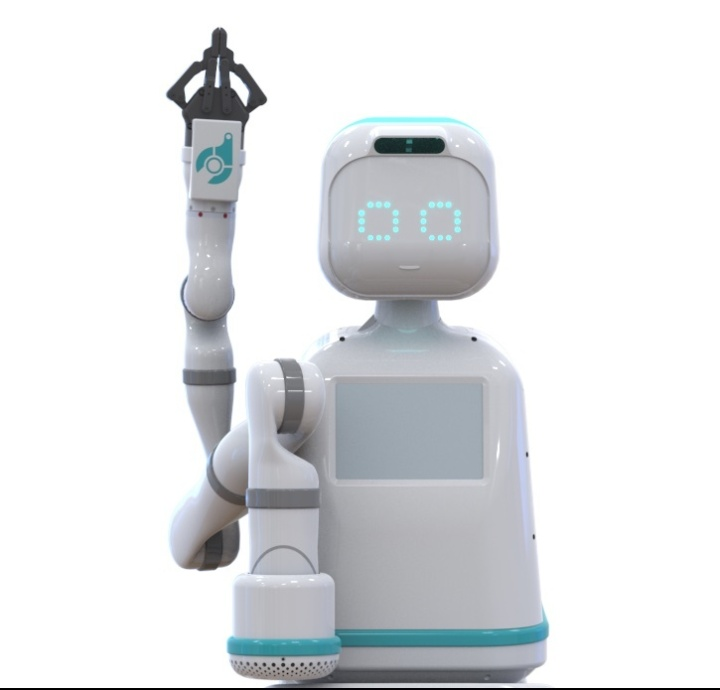
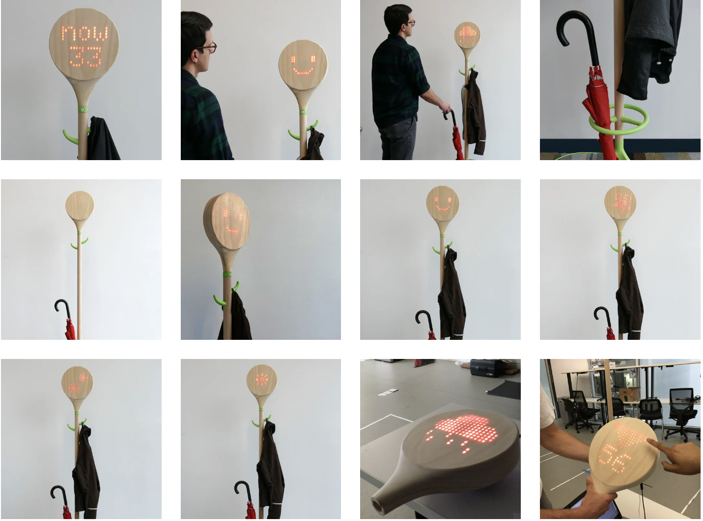

# persona-01

investigaciones individuales

## sobre adafruit i/o

**Adafruit** es una empresa y comunidad de tecnología enfocada en la electrónica DIY, en aprender, armar y programar proyectos propios con placas, sensores y componentes. Fue fundada en 2005 por la ingeniera Limor “Ladyada” Fried. Su objetivo desde el inicio fue crear el mejor lugar en línea para aprender electrónica y ofrecer productos bien diseñados para personas de distintas edades y niveles de experiencia.

**Adafruit IO**, es la plataforma en la nube de Adafruit para proyectos de Internet of Things o IoT. Sirve para conectar dispositivos, recibir datos de sensores, guardar esos datos y también interactuar con ellos desde internet. La propia documentación de Adafruit la describe como una plataforma pensada para mostrar, responder e interactuar con los datos de un proyecto, con foco en que sea fácil de usar.

Dentro de **Adafruit IO**, un **dashboard** es el panel visual donde se ve y controla un proyecto desde el navegador. Ahí puedes poner bloques como gráficos, botones, sliders, indicadores o medidores para observar lo que está pasando.

Un **feed** es el canal donde se guarda una variable o flujo de datos. Se almacenan los datos y metadatos enviados a IO. o sea el sensor de pulso, podría tener un feed llamado pulsómetro donde se van guardando los valores BPM luego ese feed se conecta a un gráfico o indicador dentro del dashboard para poder verlo en tiempo real.

`los feeds son el núcleo del sistema y que los bloques del dashboard se enlazan a uno o más feeds.`

**Arduino** = quien manda el mensaje
**Adafruit IO** = la nube que lo recibe  
**Dashboard** = la pantalla donde se ve

Arduino detecta algo.  

Por ejemplo: el sensor de pulso siente un latido.  

Entonces el Arduino dice:  

“voy a mandar este dato a internet”  

Ese dato llega a Adafruit IO, que sería como una cajita en la nube donde se guarda,

el dashboard mira esa cajita y muestra lo que hay dentro.

- **config.h** es el archivo de configuración donde se guardan los datos que el programa necesita para conectarse sin mezclar todo con el código principal.
- **archivo principal .ino** → hace funcionar el sensor, envía datos, controla la lógica  
- **archivo config.h** → guarda claves, usuario y red
- **THROTTLE WARNING** → cuenta que alcanzó el límite de velocidad de envío de datos en Adafruit IO

algunos apuntes  

pulsometro **Threshold** → qué valor de señal voy a considerar que esto ya cuenta como latido // subir si sigue detectando sin dedo el bpm  
**void setup()** → Sirve para preparar todo antes de que empiece el programa principal.
                   se preparan cosas como:

                   iniciar comunicación serial
                   definir si un pin será entrada o salida
                   conectar Wi-Fi
                   iniciar una pantalla
                   iniciar sensores

**void loop** → Es donde va la parte del programa que se repite constantemente. por ejemplo:

                leer un sensor
                prender y apagar un LED
                revisar si llegó un mensaje
                actualizar una pantalla
                mandar datos a Adafruit

 en adafruit, va void loop acompañado de io.run

**io.connect** → es la instrucción que le dice al Arduino:conéctate a Adafruit IO
**mensajeFeed->onMessage(handleMessage)**  → cuando llegue un mensaje nuevo a este feed, ejecuta la función
**void handleMessage(AdafruitIO_Data data)String texto = data->toString**  → estoy creando una función llamada handleMessage que recibe un dato de Adafruit IO
**Serial.begin(115200)** →
                Serial
                es el objeto que maneja la comunicación serial.

                .begin()
                significa iniciar

                (115200)
                es la velocidad de comunicación, llamada baud rate
                  
**mensajeFeed->onMessage(handleMessage)** → deja este feed escuchando, y cuando llegue un mensaje nuevo, ejecuta la función handleMessage

Variables:
**int tipo nombre = valor;**

               int = tipo de dato  
               contador = nombre de la variable   
               0 = valor inicial   
  
## sobre artista, diseñadora o producto que usa electrónica o computación inalámbricas

Carla Diana, cuyo trabajo cruza diseño, robótica e interacción, explora cómo los objetos inteligentes pueden comunicarse con nosotros no solo a través de su función, sino también mediante su comportamiento, movimiento y presencia. Tiene trabajos y propuestas en torno al diseño, el objeto y lo tecnológico que me parecen una locura, pero me interesó por sobre todo porque propone una forma de pensar la tecnología desde lo cotidiano, no desde una idea de futuro lejano o espectacular, sino desde objetos comunes que ya forman parte de nuestra vida diaria. Llegué a ella leyendo una entrevista en Vice y me llamó mucho la atención cómo plantea que ciertos objetos cotidianos podrían volverse más activos, expresivos e incluso más atentos a nosotros en el día a día. Cuando dice en su entrevista que comenzamos a ver comportamientos mucho más sofisticados por parte de nuestros productos cotidianos, apuntando a un futuro donde las cosas ya no solo funcionan, sino que también buscan una forma de relacionarse con nosotros de maneras nuevas. Eso me parece muy potente, porque desplaza la conversación sobre tecnología hacia un lugar más humano y menos frío. Ella propone ideas como un micrófono que se inclina para mostrar que está escuchando, una cámara que gira para dar privacidad o una cafetera que te presenta la taza y ahí los objetos dejan de ser solo aparatos útiles para empezar a tener una especie de gesto, una presencia. Me interesa especialmente esa idea de que el diseño pueda hacer más legible la intención de la tecnología, volviendo sus acciones más comprensibles, cercanas e incluso sensibles para quien las usa.

Con lo que propone, se me viene mucho a la cabeza Wallace y Gromit, película dirigida por Nick Park. Cuando era chica, veía esa escena en que se levantan y toda la tecnología de la casa se adapta a su rutina cotidiana, y a mis ojos eso era perfecto. Me fascinaba esa idea de que lo casero, lo automático y lo cotidiano pudieran convivir de una manera tan natural. Había algo muy atractivo en esa fantasía, porque no se trataba de una tecnología invasiva ni distante, sino de una tecnología integrada a la vida de una manera doméstica, amable e incluso entretenida. Y creo que eso es justamente lo que me atrae de Carla Diana: que toma algo que parecía fantasía y lo plantea como una posibilidad real, no desde una promesa exagerada, sino desde el diseño, la experimentación y la demostración de que ese tipo de relación con los objetos podría efectivamente formar parte del futuro y convertirse en una participación sutil, pero significativa dentro de un día normal. Me interesa mucho esa posibilidad de que lo tecnológico no tenga que sentirse ajeno a lo humano, sino que pueda integrarse a nuestra rutina con una sensibilidad distinta, como si los objetos dejaran de ser completamente mudos y comenzaran a comunicarse con pequeños gestos que nosotros podemos interpretar.

También quería rescatar que en la entrevista ella habla de tener que permanecer fieles a nuestros valores humanos y decidir qué productos pertenecen a nuestras vidas y qué productos no, En lugar de huir o ignorar el potencial, necesitamos centrarnos en lo bueno que puede traer y rechazar en nuestras vidas esas cosas que nos alejan de lo que nos importa. Esa idea me hace mucho sentido, porque no propone una mirada ingenua sobre la tecnología, sino una postura crítica y sensible frente a ella. No se trata de aceptar todo lo nuevo solo porque es nuevo, ni tampoco de rechazarlo por miedo, sino de preguntarnos qué tipo de vínculo queremos construir con estas herramientas y qué lugar les vamos a dar dentro de nuestra vida cotidiana. Me hace mucho sentido cómo ella se desenvuelve en la disciplina y lo que enseña al respecto. A mí me daría miedo que los humanos terminemos como en WALL-E, donde la tecnología termina reemplazando demasiadas dimensiones de la experiencia humana y nos aleja del cuerpo, del entorno y de los otros, pero al mismo tiempo me parece muy valioso que existan personas que observan la computación o la robótica desde una vereda mucho más artística o sensible, en relación con lo que ya está vivo. Creo que ahí aparece una forma distinta de pensar el futuro: no como un avance puramente técnico, sino como una construcción donde el diseño también puede aportar criterio, afecto, lenguaje y humanidad. Eso es lo que me parece más bello de su trabajo: que no solo imagina objetos más inteligentes, sino también relaciones más conscientes entre las personas y la tecnología.

Tiene formación tanto en ingeniería como en diseño: estudió Mechanical Engineering en The Cooper Union y luego hizo un MFA en 3D Design en Cranbrook Academy of Art.

Bibliografía investigación artista: 
https://www.vice.com/es/article/carla-diana-robots/ 
https://www.carladiana.com/

Apuntes y proceso de trabajo:

Al comienzo, este proceso fue para nosotras una forma muy concreta de entender que programar no consiste solo en que algo funcione o no funcione, sino en aprender a convivir con la prueba, el error, la espera y la frustración. Primero partimos usando el codigo.ino de contador que había mandado Aron, porque en clase nos había funcionado, aunque todavía no lo habíamos probado realmente con nuestra propia cuenta. Ahí apareció una de las primeras lecciones importantes del proceso: algo tan pequeño como cambiar un feed o crear un dashboard propio ya podía modificar completamente el resultado. Cuando hicimos el dashboard prueba1, con el feed mensaje, al inicio nada funcionó y pensamos que habíamos hecho algo mal, pero después de borrar, rehacer y volver a probar, terminó funcionando.

De hecho, una parte importante del aprendizaje fue darnos cuenta de que la conexión con Adafruit no era inmediata y que a veces había que esperar dos o tres minutos antes de asumir que todo estaba fallando.

Cuando pasamos al pulsómetro, el proceso se volvió aún más interesante porque dejó de ser solo repetir un código y pasó a ser una verdadera búsqueda. Ya no queríamos que el sensor entregara simplemente BPM, sino que queríamos transformarlo en otra cosa: que la actividad del cuerpo pudiera activar un mensaje, en este caso, “amistad es amigo”. Ahí empezamos a entender que trabajar con componentes externos implicaba no solo conectar cables, sino también comprender que cada elemento trae su propia lógica y su propio lenguaje dentro del código, como ocurrió con la librería #include <PulseSensorPlayground.h>. También nos enfrentamos a algo muy real del aprendizaje técnico: hay muchísimos tutoriales, pero casi nunca existe uno que responda exactamente a lo que una quiere hacer. Por eso tuvimos que mirar referencias, mezclar códigos, intentar unir partes que parecían servirnos y, en medio de eso, pedir ayuda para ordenar lo que no lográbamos resolver solas.

Con el pulsómetro también apareció un problema que fue muy revelador: el sensor era demasiado sensible y mandaba demasiados mensajes en muy poco tiempo, lo que terminaba colapsando Adafruit. Eso nos obligó a cambiar la lógica inicial y dejar de pensar en el dato exacto del BPM para empezar a pensar en la presencia, en la detección de actividad y en el tiempo de espera. Ahí surgió la idea de usar const unsigned long tiempoSinLatido = 3000;, para que el mensaje se enviara solo después de cierto tiempo sin actividad.

Después vino la pantalla OLED, y con ella otra capa de complejidad que también fue muy formativa. A diferencia del pulsómetro, aquí primero hubo que entender cómo se conectaba físicamente, buscar tutoriales, conseguir los cables correctos y descargar nuevas librerías. Ese paso fue importante porque nos hizo ver que cada componente nuevo obliga a reaprender una parte del proceso, incluso antes de programar. Luego quisimos que la pantalla mostrara un corazón cada cierto tiempo y que, al aparecer ese corazón, también se enviara el mensaje “amistad es amigo” al dashboard.

Más adelante, cuando intentamos que el sistema funcionara a distancia entre dos casas, el proyecto dejó de sentirse como una suma de ejercicios separados y empezó a tomar forma como una experiencia más completa. Queríamos que un Arduino enviara los mensajes “amistad es amigo” y “te extraño amigo” según el estado de un LED, y que eso pudiera verse en otro lugar, primero en un dashboard y luego en una pantalla OLED conectada a otro Arduino. En esa parte recordamos cosas muy básicas, como la lógica de false y true, y fue interesante ver cómo conceptos tan iniciales terminaban teniendo un rol real dentro del proyecto. También fue la parte más larga y más frustrante, porque probamos muchas cosas que no funcionaron: cambiamos feeds, revisamos configuraciones, intentamos conectarnos desde un dashboard al otro lado, esperamos varios minutos, pensamos que el problema podía ser la distancia, e insistimos incluso cuando parecía no haber avance. Pero justamente por eso, cuando cambiamos la dirección del proceso, hicimos que el Arduino 01 se conectara al dashboard correcto mediante mensaje2, y luego logramos que el Arduino 02 recibiera ese mensaje para imprimirlo en la OLED, la sensación fue completamente distinta. Ya no era solo alivio por haberlo logrado, sino la impresión de haber entendido algo que antes parecía demasiado lejano.

