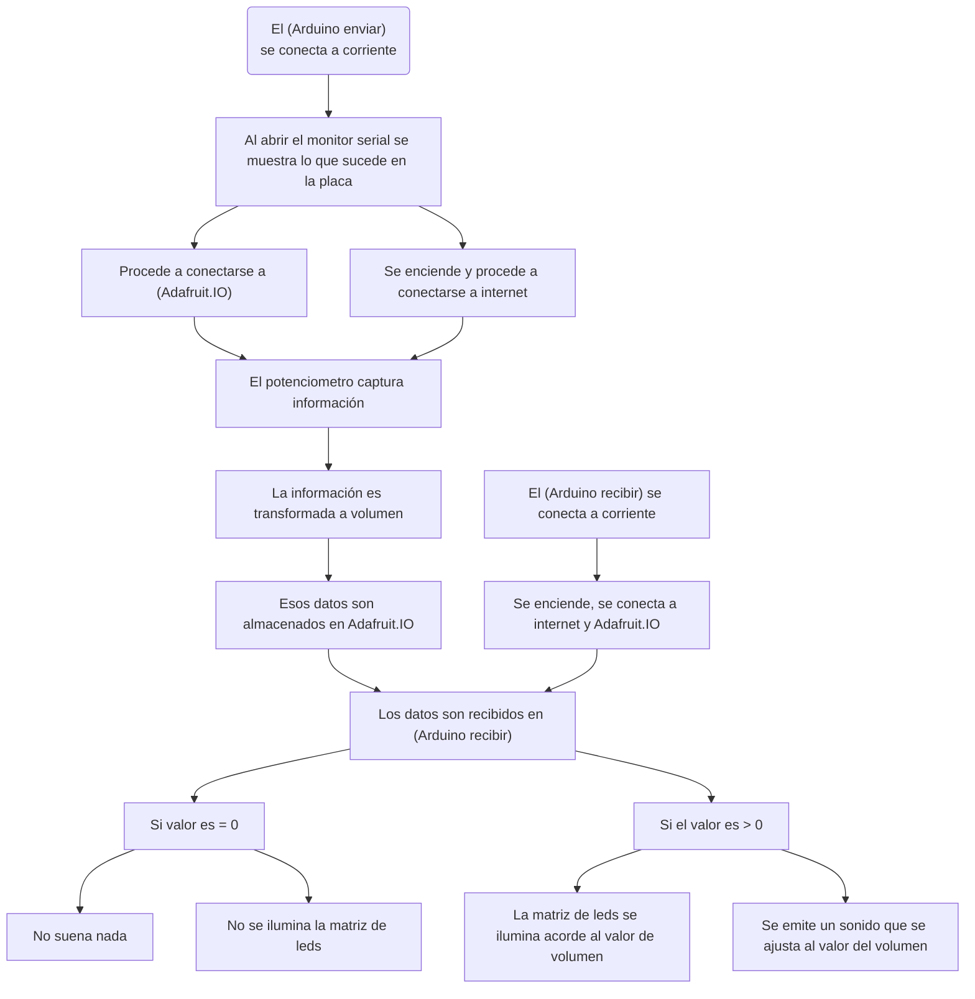

# ⋆⭒˚.⋆ └[∵┌] - Grupo 05 - Conexión sonora a distancia - [┐∵]┘ ⋆.˚⭒⋆

Lunes 13 Abril 2026

***

## Integrantes "Sonoridad":

* [Felipe Caurapan](https://github.com/felipecaurapan):
* [Camila Parada](https://github.com/Camila-Parada): Código, Bill of Materials, Redacción de texto
* [Vania Paredes](https://github.com/paredesvania): Código, Circuito, Redacción de texto, Registro


## Descripción del proyecto "Don Volumen"

Sistema de transmisión de audio inalámbrico en tiempo real, donde un potenciómetro conectado a una placa Arduino UNO R4 WIFI, controla el volumen de un altavoz ubicado en otra placa Arduino UNO R4 WIFI, comunicados a través de internet mediante el protocolo MQTT de Adafruit IO.

El proyecto consiste en dos Arduino UNO R4 WIFI conectados a internet. El Arduino emisor lee una señal analógica desde un potenciómetro y la convierte en un valor de volumen entre 0 y 100, que publica en un feed de la plataforma Adafruit IO usando el protocolo MQTT. El Arduino receptor se suscribe a ese mismo feed y, al recibir cada valor, ejecuta dos acciones simultáneas: reproduce un tono en un altavoz de 8Ω controlando la amplitud real de la señal mediante PWM y un transistor NPN 2N2222, y actualiza una barra de nivel visual en la matriz LED integrada del Arduino R4 WiFi, encendiendo filas de abajo hacia arriba proporcionales al volumen recibido.

## Video en Funcionamiento

[](https://youtube.com/shorts/Q4U23jE60xg?si=ce4Ev4bNzpgEaBKN)

## Bill of materials

| Componentes         | Tipo  | Cantidad | Precio  | Enlace            |
| ------------------- | ----- | -------- | ------- | ----------------  |
| Arduino UNO R4 WiFi | Placa de desarrollo | 2   | $38.990 | <https://mcielectronics.cl/shop/product/43402/> |
| Mini Protoboard 400 Puntos | Placa prototipado | 2  | $1.500 | <https://afel.cl/products/mini-protoboard-400-puntos> |
| Potenciómetro 1K Ohm | Componente | 1 | $1.490 | <https://mcielectronics.cl/shop/product/potenciometro-1k-ohm/> |
| Cable Dupont Macho Macho 10cm | Cable | Pack 40 | $2.590 | <https://mcielectronics.cl/shop/product/cable-dupont-macho-macho-20cm-pack-40-unidades/> |
| Altavoz 8 Ohm 1W | Componente | 1 | $ 2.590 | <https://www.mechatronicstore.cl/altavoz-8-ohm-1w> |
| Transistores NPN 2N2222 | Componente | Pack 10 | $1.228 | <https://altronics.cl/pack-10-transistor-2n2222> |
| Resistencia 1k Ohm 1/2 watts | Componente | Pack 5 |  $500 | <https://triacs.cl/accesorios/1101-resistencia-1k-ohm-12w-5-unid-.html> |


## Código usado con Adafruit IO

Para su funcionamiento fue necesaria la creación de 2 códigos distintos: uno enfocado en utilizar un componente (potenciometro) para obtener información que es subida a una nube, y otro para poder recibir dicha información y permitir a la segunda parte mostrar una animación en el matriz de leds y emitir un sonido que varía según el volumen.

### código para enviar: potenciometro y datos

```cpp
// ============================================================
// EMISOR - Lee potenciómetro y envía valor de volumen a Adafruit IO
// Arduino R4 WiFi
// ============================================================

#include "config.h"   // Credenciales WiFi y Adafruit IO

// --- CONFIGURACIÓN DEL POTENCIÓMETRO ---
// Conexión:
//   Pin izquierdo  → GND
//   Pin central    → A0  (señal analógica)
//   Pin derecho    → 5V
const int PIN_POTENCIOMETRO = A0;

// --- FEED DE ADAFRUIT IO ---
// Mismo nombre exacto que usa el receptor
AdafruitIO_Feed *feedVolumen = io.feed("paredesvania-volumen");

// --- VARIABLE GLOBAL ---
// Guarda el último valor enviado para no repetir envíos innecesarios
int ultimoVolumen = -1;

// ============================================================
void setup() {

  // Iniciar comunicación serial a 115200 baud
  Serial.begin(115200);

  // Esperar a que el Monitor Serial esté listo
  while (!Serial);

  Serial.print("Conectando a Adafruit IO...");

  // Conectar usando las credenciales del config.h
  io.connect();

  // Esperar hasta que la conexión sea exitosa
  while (io.status() < AIO_CONNECTED) {
    Serial.print(".");
    delay(500);
  }

  // Confirmar conexión
  Serial.println();
  Serial.println(io.statusText());
  Serial.println("Listo para enviar volumen!");
}

// ============================================================
void loop() {

  // Mantener conexión activa con Adafruit IO
  io.run();

  // --- LEER EL POTENCIÓMETRO ---
  // analogRead devuelve 0–1023 según la posición del potenciómetro
  int lecturaRaw = analogRead(PIN_POTENCIOMETRO);

  // Convertir 0–1023 a 0–100 (porcentaje de volumen)
  int volumen = map(lecturaRaw, 0, 1023, 0, 100);

  // Mostrar en Monitor Serial para verificar
  Serial.print("Lectura cruda: ");
  Serial.print(lecturaRaw);
  Serial.print(" -> Volumen: ");
  Serial.print(volumen);
  Serial.println("%");

  // --- ENVIAR SOLO SI EL VALOR CAMBIÓ ---
  // Evita saturar el feed de Adafruit IO con valores repetidos
  if (volumen != ultimoVolumen) {

    Serial.print("Enviando: ");
    Serial.println(volumen);

    // Publicar el valor en el feed
    feedVolumen->save(volumen);

    // Actualizar el último valor enviado
    ultimoVolumen = volumen;
  }

  // Pausa de 200ms entre lecturas
  delay(200);
}
```

### Código para recibir: parlantes y panel de leds

```cpp
// ============================================================
// RECEPTOR - Adafruit IO → Altavoz 8Ω (via transistor) + LED Matrix
// Arduino R4 WiFi
//
// CONEXIÓN FÍSICA DEL ALTAVOZ:
//   Pin 9  → Resistencia 1kΩ → Base del transistor (2N2222 o BC547)
//   Colector del transistor  → Pin (-) del altavoz
//   Pin (+) del altavoz      → 5V
//   Emisor del transistor    → GND
//   GND Arduino              → GND (común con emisor)
//
// IMPORTANTE: Pin 9 es PWM en el R4 WiFi, necesario para
// controlar la amplitud real del tono con analogWrite()
// ============================================================

#include "config.h"              // Credenciales WiFi y Adafruit IO
#include "Arduino_LED_Matrix.h"  // Librería de la matriz LED integrada del R4

// --- MATRIZ LED ---
ArduinoLEDMatrix matrix;

// --- PIN DEL ALTAVOZ ---
// Debe ser un pin PWM para poder controlar el volumen real
// En el R4 WiFi los pines PWM son: 3, 5, 6, 9, 10, 11
const int PIN_ALTAVOZ = 9;

// Frecuencia del tono en Hz
// 440 Hz = nota La (referencia musical estándar)
// Puedes cambiar esto: 261=Do, 329=Mi, 392=Sol
const int FRECUENCIA_TONO = 440;

// --- FEED DE ADAFRUIT IO ---
AdafruitIO_Feed *feedVolumen = io.feed("paredesvania-volumen");

// --- BUFFER DE LA MATRIZ LED (8 filas × 12 columnas) ---
uint8_t frameMatrix[8][12];

// ============================================================
// FUNCIÓN: reproducirConVolumen
// Controla el volumen REAL del altavoz usando PWM
// En lugar de solo cambiar la duración, cambia la amplitud
// de la señal enviada al transistor
// ============================================================
void reproducirConVolumen(int volumen) {

  if (volumen == 0) {
    // Volumen 0 → apagar completamente el altavoz
    // analogWrite(pin, 0) pone el pin en LOW constante
    analogWrite(PIN_ALTAVOZ, 0);
    return;
  }

  // Convertir volumen (1-100) a ciclo de trabajo PWM (1-128)
  // analogWrite acepta valores 0-255
  // Limitamos a 128 (50%) para proteger el altavoz de 0.5W
  // con 5V y 8Ω la corriente máxima es V/R = 5/8 = 0.625A → riesgoso
  // al 50% PWM reducimos la potencia efectiva a niveles seguros
  int pwmAmplitud = map(volumen, 1, 100, 5, 128);

  // Duración del tono proporcional al volumen
  // tono más fuerte → suena más tiempo
  int duracion = map(volumen, 1, 100, 80, 400);

  // --- GENERAR EL TONO MANUALMENTE CON PWM ---
  // tone() no es compatible con analogWrite() al mismo tiempo
  // así que generamos el tono a mano con un bucle:
  // alternamos entre la amplitud PWM y 0 a la frecuencia deseada

  unsigned long tiempoInicio = millis();
  // Periodo de medio ciclo en microsegundos
  // Para 440 Hz: periodo completo = 1/440 = 2272 µs → medio ciclo = 1136 µs
  unsigned long semiPeriodo = 1000000UL / (FRECUENCIA_TONO * 2);

  // Repetir el ciclo durante toda la duración del tono
  while (millis() - tiempoInicio < (unsigned long)duracion) {
    analogWrite(PIN_ALTAVOZ, pwmAmplitud); // fase positiva
    delayMicroseconds(semiPeriodo);
    analogWrite(PIN_ALTAVOZ, 0);           // fase negativa (silencio)
    delayMicroseconds(semiPeriodo);
  }

  // Silencio breve entre tonos para que se escuche como pulso
  analogWrite(PIN_ALTAVOZ, 0);
  delay(60);
}

// ============================================================
// FUNCIÓN: dibujarBarraVolumen
// Enciende filas de la matriz LED de abajo hacia arriba
// proporcional al volumen recibido (0-100)
// ============================================================
void dibujarBarraVolumen(int volumen) {

  // Limpiar toda la matriz (apagar todos los LEDs)
  memset(frameMatrix, 0, sizeof(frameMatrix));

  if (volumen == 0) {
    // Volumen 0 → todo apagado
    matrix.renderBitmap(frameMatrix, 8, 12);
    return;
  }

  // Calcular cuántas filas encender (de 1 a 8)
  // Fila 7 = abajo, Fila 0 = arriba
  int filasEncendidas = map(volumen, 1, 100, 1, 8);

  // Encender filas desde abajo (fila 7) hacia arriba
  for (int fila = 7; fila >= (8 - filasEncendidas); fila--) {
    for (int col = 0; col < 12; col++) {
      frameMatrix[fila][col] = 1;
    }
  }

  // Actualizar la pantalla LED
  matrix.renderBitmap(frameMatrix, 8, 12);
}

// ============================================================
void setup() {

  Serial.begin(115200);
  while (!Serial);

  // Inicializar la matriz LED integrada
  matrix.begin();

  // Animación de inicio: encender todo brevemente
  // para verificar que la pantalla funciona
  memset(frameMatrix, 1, sizeof(frameMatrix));
  matrix.renderBitmap(frameMatrix, 8, 12);
  delay(500);
  memset(frameMatrix, 0, sizeof(frameMatrix));
  matrix.renderBitmap(frameMatrix, 8, 12);

  // Configurar pin del altavoz como salida
  pinMode(PIN_ALTAVOZ, OUTPUT);
  analogWrite(PIN_ALTAVOZ, 0); // Asegurar silencio al arrancar

  // Conectar a Adafruit IO
  Serial.print("Conectando a Adafruit IO...");
  io.connect();

  while (io.status() < AIO_CONNECTED) {
    Serial.print(".");
    delay(500);
  }

  Serial.println();
  Serial.println(io.statusText());

  // Suscribirse al feed: cuando llegue un dato nuevo
  // se llamará automáticamente manejarVolumen()
  feedVolumen->onMessage(manejarVolumen);

  // Pedir el último valor del feed para no arrancar en blanco
  feedVolumen->get();

  Serial.println("Listo. Escuchando feed de volumen...");
}

// ============================================================
void loop() {
  // Mantener conexión activa y procesar mensajes entrantes
  // El callback manejarVolumen() se dispara automáticamente aquí
  io.run();
}

// ============================================================
// CALLBACK - Se ejecuta al recibir un dato nuevo del feed
// ============================================================
void manejarVolumen(AdafruitIO_Data *dato) {

  // Leer el valor enviado por el emisor (0 a 100)
  int volumen = dato->toInt();

  // Asegurar que esté dentro del rango válido
  volumen = constrain(volumen, 0, 100);

  Serial.print("Volumen recibido: ");
  Serial.print(volumen);
  Serial.println("%");

  // Actualizar la barra visual en la matriz LED
  dibujarBarraVolumen(volumen);

  // Reproducir el tono con el volumen real controlado por PWM
  reproducirConVolumen(volumen);
}
```

* Los archivos tipo "config.h" fueron modificados en las credenciales de la "cuenta de adafruit" y se utilizó el internet del lid para su funcionamiento.

## Mapa de flujo



### Monitor Serial de Arduino
..................................................................................................
Adafruit IO connected.

Listo para enviar volumen!

Lectura: 0 -> Volumen: 0%

Enviando: 36

Lectura: 446 -> Volumen: 43%

Enviando: 43

Lectura: 478 -> Volumen: 46%

Enviando: 46

Lectura: 512 -> Volumen: 50%

Enviando: 50

Lectura: 565 -> Volumen: 55%

Enviando: 55

Lectura: 569 -> Volumen: 55%

Lectura: 624 -> Volumen: 60%

Enviando: 60

Lectura: 688 -> Volumen: 67%

Enviando: 67

Lectura: 746 -> Volumen: 72%

Enviando: 72

Lectura: 808 -> Volumen: 78%

Enviando: 78

Lectura: 865 -> Volumen: 84%

Enviando: 84

Lectura: 938 -> Volumen: 91%

## Investigaciones individuales

Aportes, información y exploraciones personales compartidas con el equipo.

- [Felipe Caurapan.md](./persona-01.md)

- [Camila Parada.md](./persona-02.md)

- [Vania Paredes.md](./persona-03.md)

## Bibliografía

* <https://learn.adafruit.com/series/adafruit-io-basics>
* <https://github.com/adafruit/Adafruit_IO_Arduino>
* <https://github.com/adafruit/Adafruit_IO_Arduino/blob/master/examples/adafruitio_01_subscribe/adafruitio_01_subscribe.ino>
* <https://docs.arduino.cc/tutorials/uno-r4-wifi/wifi-examples/#wi-fi-udp-send-receive-string>
* <https://forum.arduino.cc/t/ide-no-reconoce-puertos-com/353276>
