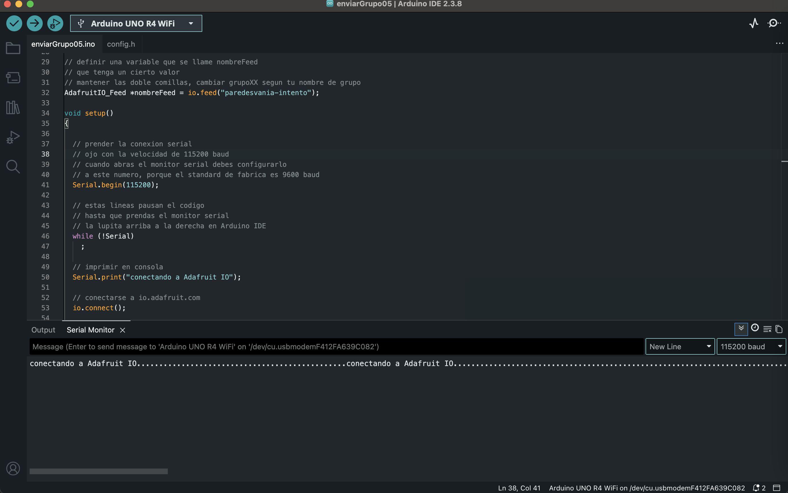

# persona-03

## Vania Paredes

## sobre adafruit i/o

## 04.04.26

* Lo primero que hice fue instalar biblioteca de Adafruit IO para Arduino y crear mi cuenta en adafruit IO luego puse los códigos de enviarArduino, los leí para entenderlos y saber que debía modificar, puse mis datos en config.h y ver si el código se subía bien.

* Al inicio no podía subir el código al Arduino. Me aparecía un error de que no se encontraba el dispositivo. Revisé varias cosas: el cable USB, la placa seleccionada y el puerto wn tools. Aunque el puerto aparecía, no funcionaba.

* Probé cambiar el puerto manualmente, reiniciar el IDE, desconectar y reconectar la placa, y usar el botón RESET.

* Finalmente probé con otra placa Arduino y ahí funcionó altiro, concluí que la primera placa estaba fallando, ya que no podía ser el cable ya que lo he usado anteriormente.

* Después de eso, logré subir el código, pero el monitor serial mandaba un mensaje extraño, lo dejé ahí. 

* Revisé el baud rate (115200), lo cambié, volví a subir el codigo y ahora el monitor serial no mostraba nada.

* Cambié el puerto en mi computador y el monitor empezó a mostrar actividad, pero solo aparecían puntos infinitos. Entendí que eso significaba que el Arduino estaba intentando conectarse a internet pero no lo lograba.

* Probé varias soluciones:

  * Revisé las credenciales de Adafruit IO (usuario y key)
  * Incluso generé una nueva key y la cambie
  * Cambié la red WiFi por una no 5G (creí que podía ser un problema)
  * Usé hotspot del celular para descartar problemas de red

* Aun así no funcionaba, como ya que había leído lo que escribió Aarón sobre las updates de la placa, dije, bueno, por qué no actualizarlo ahora?,quizas podia ser un problema de firmware en la placa y si no era, cuando se conectara me podía mandar a ese error igualmente porque no estaba actualizada, así que, por qué no evitar?

* Empecé el proceso de actualización del firmware desde Arduino IDE

* Como Aarón dijo que esto toma un tiempo, fui a hacerme un pancito, gran error, cuando volvi la pantalla del compu se habia apagado por lo que todo se detuvo y tuve que hacerlo de nuevo, asi que ahora me encuentro escribiendo esto tratando de que no se apague el computador.
* Ahora que la comece  actualizar me mandaba error, desconecté todo, ocupé RESET y puse actualizar de nuevo, ahora si funcionaba.

* En paralelo, mientras esperaba, me fui a learn.adafruit y leí sobre los feeds, so avancé creando el feed “grupo05”, asegurándome de que coincidiera exactamente con el nombre en el código.

La actualización realmente se toma su tiempo, ha pasado una hora desde que empezó.

Okay, ha pasado un poco más de hora y media y aún no se termina de actualizar, terminaré esta misión mañana.

Mis placas están en coma, en recuperación con el doctor aarón.

Por mientras subí el código ahora con un arduino mañoso que funciona cuando quiere y no tiene la acrtualización, pero ahora me apareció mas info en el monitor serial.

Por otro lado, cami pudo enviar desde su compu, así que perfect, ahora queremos modificar el código para que envíe algo más que números. seguimos trabajando.

Queremos como grupo, enviar un sonido desde un arduino conectado a un potenciómetro, y que este potenciómetro controle el volumen de el sonido que sonará en el otro arduino que recibirá.
El arduino que recibe tendrá conectado un altavoz, por el que sonará el sonido enviado y en la pantalla de leds se verá una barra de leds que muestre el volumen de manera gráfica.

logramos hacer que el potenciómetro funcionara!

## sobre artista, diseñadora o producto que usa electrónica o computación inalámbricas

## Rafael Lozano-Hemmer

### ¿Quién es?

Rafael Lozano-Hemmer es un artista mexicano/canadiense que trabaja con tecnología, creando instalaciones interactivas a gran escala donde el público es parte de la obra. No son obras “para mirar”, sino experiencias que solo existen cuando alguien participa.

Tiene formación en química, lo que influye mucho en su forma de trabajar: mezcla ciencia, arte y experimentación en sus proyectos.

### ¿Qué hace?

Su trabajo se basa en crear **instalaciones interactivas** usando:
* sensores
* cámaras
* luces
* sonido
* datos en tiempo real
* software y redes

Estas obras reaccionan a las personas: a su presencia, voz, movimiento o incluso datos biométricos. 

### Por ejemplo:

**Pulse Room** (2006)

Es una instalación con cientos de ampolletas colgando. Cuando una persona pone sus manos en un sensor, el sistema detecta su pulso.
Ese pulso se transforma en luz: una ampolleta comienza a parpadear con tu ritmo cardíaco.
Luego, ese pulso se guarda y se distribuye en el resto de las luces.

tu cuerpo se convierte en datos, esos datos se vuelven visuales, la obra acumula la presencia de muchas personas

Increíble cómo la tecnología registra y guarda datos humanos constantemente.

**Border Tuner** (2019)

Instalación en la frontera entre México y EE.UU, Usa grandes luces (tipo reflectores) que las personas pueden controlar.Cuando dos luces se cruzan en el cielo, se abre un canal de audio. Las personas pueden hablar entre sí a través de la frontera!!!

usa tecnología para conectar personas separadas físicamente y convierte una frontera (división) en un punto de encuentro

**Remote Pulse** (2019)

Dos estaciones conectadas por internet, dos personas, en lugares distintos, ponen sus manos en sensores, pueden sentir el latido del corazón del otro en tiempo real

Hace que la comunicación digital deje de ser solo visual o textual, y se vuelva corporal. Es una forma más íntima de conexión mediada por tecnología.

### Idea clave de su trabajo

El público **NO es espectador, es parte de la obra**

Él mismo describe sus proyectos como: “plataformas de participación pública” o “teatro tecnológico”

Crea sistemas donde la gente interactúa y genera la experiencia.

Creo que quizás sus obras muchas veces hacen sentir incómodo al usuario, porque muestran cómo la tecnología observa o registra todo.

#### Reflexión 

Lo interesante de su trabajo no es solo la tecnología, sino cómo la usa para cuestionar cosas, la usa como metáfora también a mi parecer, como en su obra en la frontera, una frontera que conecta? increible. dónde termina el usuario y empieza el sistema?

#### Fuentes

* <https://www.quebec.ca/en/news/actualites/detail/rafael-lozano-hemmer-at-the-mac-an-embodied-experience>
* <https://en.wikipedia.org/wiki/Rafael_Lozano-Hemmer>
* <https://www.unsw.edu.au/news/2023/08/the-interactive-art-of-rafael-lozano-hemmer--psychic-resonance-->
* <https://www.lozano-hemmer.com/pulse_room.php>
* <https://www.lozano-hemmer.com/border_tuner__sintonizador_fronterizo.php>
* <https://www.lozano-hemmer.com/remote_pulse.php>

