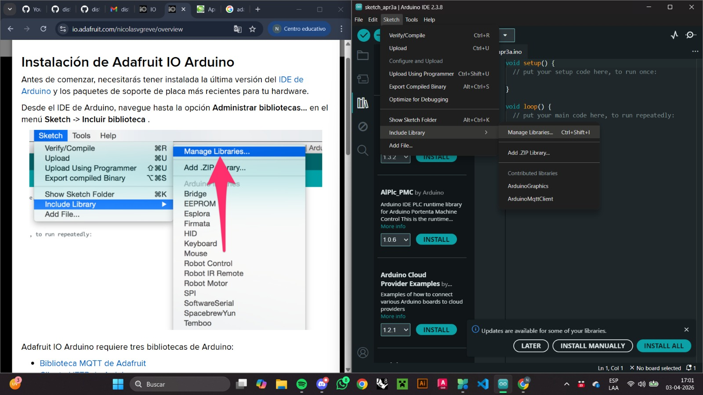
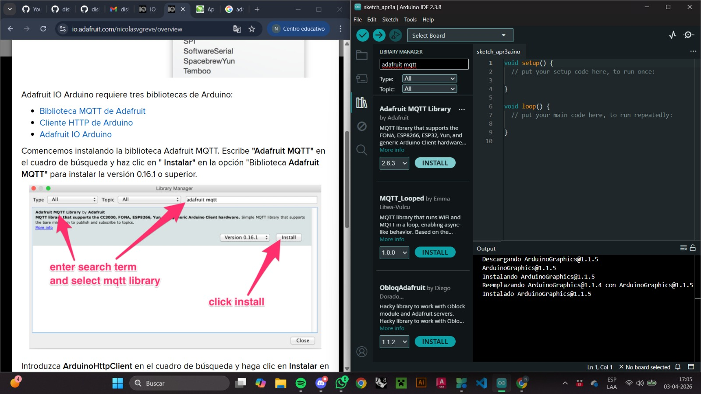
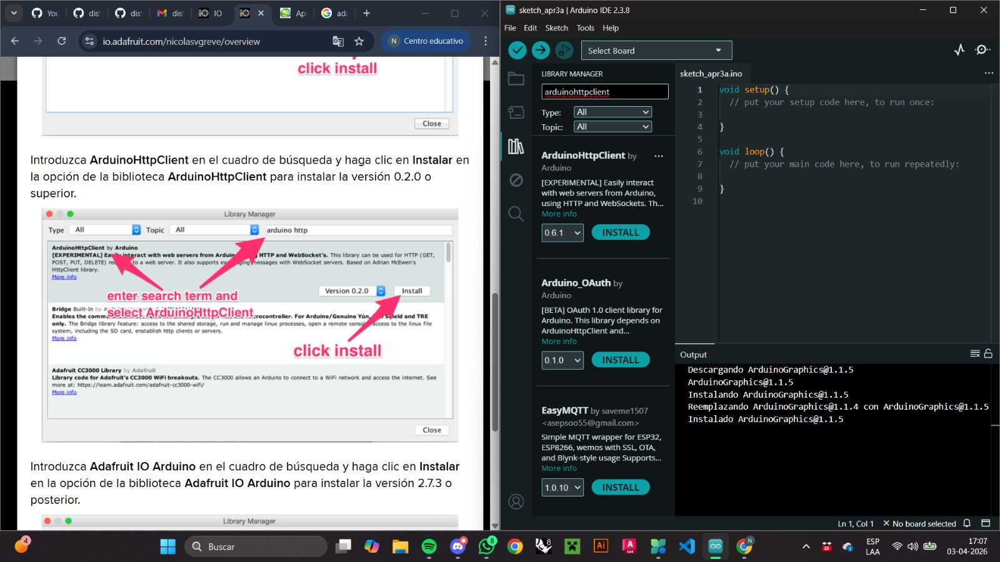
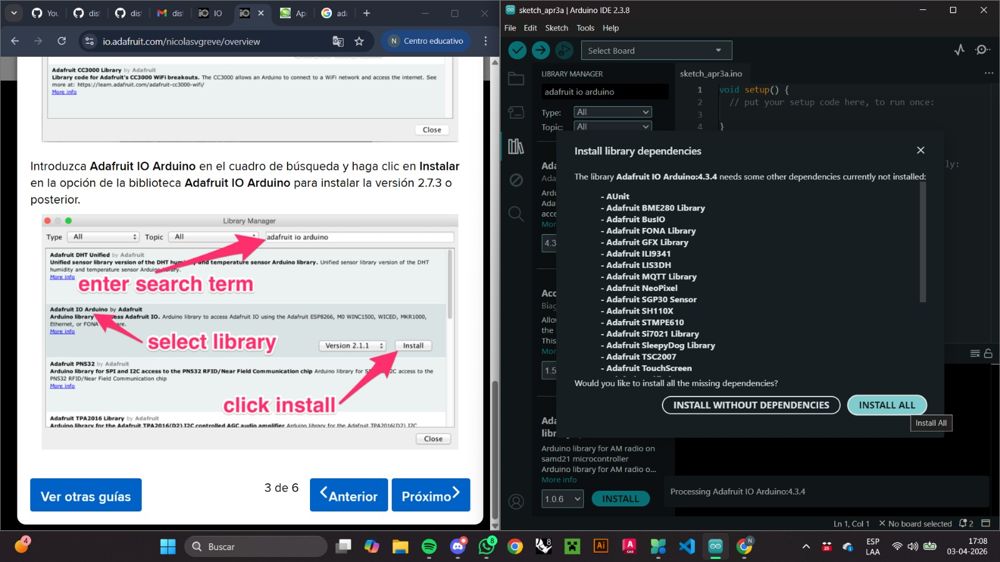

# persona-03 - Nicolás Valdés Greve

Nicolás Elías Valdés Greve, investigaciones individuales

---

## sobre adafruit i/o

Al inicio había entendido que Adafruit IO era un programa que tendríamos que instalar (así como Arduino IDE), por lo que estuve buscando tutoriales de cómo descargarlo hasta que me di cuenta que teníamos que hacerlo dentro de Arduino IDE, pero antes de hacer todo el proceso de instalar busqué un tutorial que me pudiese ayudar a entender qué es lo que tenía que hacer dentro de Adafruit IO, por lo que me guié de los primeros pasos que indica este tutorial: <https://mkelectronica.com/aprende-a-utilizar-la-plataforma-adafruit-io-para-tus-dispositivos-iot-parte-1/>, los cuales fueron crear una cuenta y el cómo identificar dónde está nuestra llave de Adafruit la cual nos servirá para todo lo que hagamos (ésta se encuentra en la llave encerrada en un círculo amarillo en la esquina superior derecha de la pantalla). No saqué screenshot de este proceso ya que asumí que era algo privado y que no debo compartir de manera pública.

Luego, para poder instalarlo busqué tutoriales en videos de youtube, pero al final terminé usando el tutorial que sale en la página de Adafruit IO en la parte inferior de la página. Aquí se puede ver dónde encontrarlo:

En la sección inferior aparecen muchos links, pero el que nos sirve en éste caso es el de ``Quick Guides``, y como menciona el link, podemos encontrar una variedad de guías, siendo éstas las que aparecen:

Adafruit nos ofrece toda esta lista de guías rápidas para que podamos empezar con nuestros proyectos, pero en éste caso el que seleccionaremos es el que dice ``Getting Started With Arduino``.

### Paso 1

Como nuestro primer paso se nos indica buscar el "Administrar Biblioteca", que se puede acceder de la manera que se muestra en la foto o también puedes seleccionar los libros que salen al costado izquierdo de la pantalla y será exactamente lo mismo.

### Paso 2

Como segundo paso se nos indica escribir en el buscador "Adafruit MQTT" e instalar la opción que dice "Adafruit MQTT Library".

### Paso 3

Como tercero paso se nos indica escribir en el buscador "ArduinoHTTPClient" e instalar la versión más actual.

### Paso 4

Como cuarto y último paso se nos indica escribir en el buscador "Adafruit IO Arduino" e instalar la última versión de éste. Al momento de seleccionar la opción de instalar, te saldrá un anuncio que dice que para que ésta biblioteca funcione debes instalar todo el listado que menciona, en lo cual debemos aceptar y se empezarán a instalar todos los archivos de manera autónoma.

Ya tenía todo para Adafruit IO instalado, pero seguía sin entender para qué era realmente la plataforma, por lo que me puse a leer y en la misma página nos explican que Adafruit IO es un servicio en la nube para desarrollar proyectos de _Internet of Things_ (IoT) mientras que al mismo tiempo nos ofrece guías para que podamos desarrollar nuestros proyectos. Se nos menciona que Adafruit IO también tiene bibliotecas para lenguajes como Arduino, Python, CircuitPython y otros.

Adafruit IO también nos permite agregar, almacenar y visualizar datos en tiempo real en la nube desde dispositivos IoT conectados e interactuar con los mismos dispositivos desde los ``Dashboards``, los cuales se ven forman a partir de ``Feeds``.

### Fuentes Adafruit IO

- MK Electrónica. (16 junio, 2022). Aprende a utilizar la plataforma Adafruit IO para tus dispositivos IoT (parte 1) | MK Electronica. MK Electronica. <https://mkelectronica.com/aprende-a-utilizar-la-plataforma-adafruit-io-para-tus-dispositivos-iot-parte-1/>
- Adafruit IO. (n.d.). Adafruit IO. <https://io.adafruit.com/welcome>
- IoT, G. (n.d.). Aprende a utilizar la plataforma Adafruit IO para tus dispositivos IoT (parte 1). Generación IoT. <https://internetdelascosas.xyz/articulo.php?id=175&titulo=Aprende-a-utilizar-la->

---

## sobre artista, diseñadora o producto que usa electrónica o computación inalámbricas

# MiMU Gloves - Imogen Heap

Imogen Heap (09/12/1977) es una artista británica que inició su desarrollo musical al aprender piano en su casa cuando era adolescente, decidiendo en ese momento que quería dedicarse a una carrera musical. A lo largo de su carrera musical, ha logrado obtener bastantes reconocimientos a su nombre incluyendo dos Grammy's: uno por "Mejor Ingeniería Musical" para su álbum _"Elipse"_ y otro por su contribución en el álbum _"1989"_ de la artista Taylor Swift, en donde coescribió, cointerpretó y produjo la canción _"Clean"_ de dicho álbum, pero más allá de su carrera musical, Heap es pionera en la búsqueda de cruces entre la tecnología y la música, siendo conocida por desarrollar los **"MiMU Gloves"**.

Los guantes MiMU fueron creados por un la artista Imogen Heap junto a un equipo de la "University of West England" el cual era encabezado por Tom Mitchell, especialista en tecnología de la música. Heap quería desarrollar formas en las cuales podía ser más expresiva y espontánea sobre el escenario, por lo cual había utilizado micrófonos inalámbricos en las muñecas en el pasado, pero sentía que faltaba el poder controlar la música de manera inalámbrica, razón por la cual se reunió el equipo que estaba compuesto por músicos, ingenieros, diseñadores textiles y desarrolladores de software.

Los primeros prototipos de los guantes se crearon en base a las experimentaciones musicales de Heap y fueron probándose en presentaciones en directo, los cuales en su momento mostraban cables que se conectaban a más componentes que estaban al rededor del cuerpo para poder sostenerse como se puede ver en el siguiente video: <https://www.youtube.com/watch?v=ci-yB6EgVW4>. Eventualmente los guantes fueron teniendo sus actualizaciones y ahora tienen una forma mucho más compacta como lo podemos ver en la siguiente imagen:

(imagen rescatada de la página oficial de MiMU, no me pertenece)

Para llegar al resultado que tenemos hoy, Mitchell modificó guantes de fibra óptica que en ese tiempo eran desarrollados para la industria de los video juegos, y los programó teniendo en cuenta los movimientos de Heap. En los guantes se encuentran unos chips que contienen acelerómetros y magnetómetros los cuales son una unidad de medición inercial (IMU) y son capaces de generar información precisa sobre la posición de las manos y la velocidad de éstas, incluyendo ocho sensores de flexión que pueden medir la curvatura de los dedos:

- Pulgar
- Índice _proximal_
- Índice _distal_
- Medio _proximal_
- Medio _distal_
- Anular _proximal_
- Anular _distal_
- Meñique

En el pulgar y en el meñique tienen un solo sensor de flexión mientras que en los otros dedos tienen dos, en donde el que está más cerca a la punta se denomina _distal_ y el más cercano a la muñeca se llama _proximal_.

Para usar los guantes crearon el software **Glover**, el cual se utiliza para programar, componer y performar música utilizando el movimiento de los guantes MiMU. D

---

### Fuentes Artista

- MIMU — Music through Movement. (n.d.). <https://mimugloves.com/documentation/mimu-gloves-overview/>
- Castañeda, S., & Castañeda, S. (28 junio, 2025). Imogen Heap - It sounds alternative. It Sounds Alternative - Nos gusta la música y nos gusta compartirla. <https://itsoundsalternative.com/2025/01/17/imogen-heap/>
- Wakefield, J. (14 julio, 2011). Guantes electrónicos para hacer música. BBC News Mundo. <https://www.bbc.com/mundo/noticias/2011/07/110714_tecnologia_guantes_musicales_nc>
- MIMU — Music through Movement. (n.d.). <https://mimugloves.com/about/>
- MiMU — Glover. (n.d.). <https://mimugloves.com/glover/>
