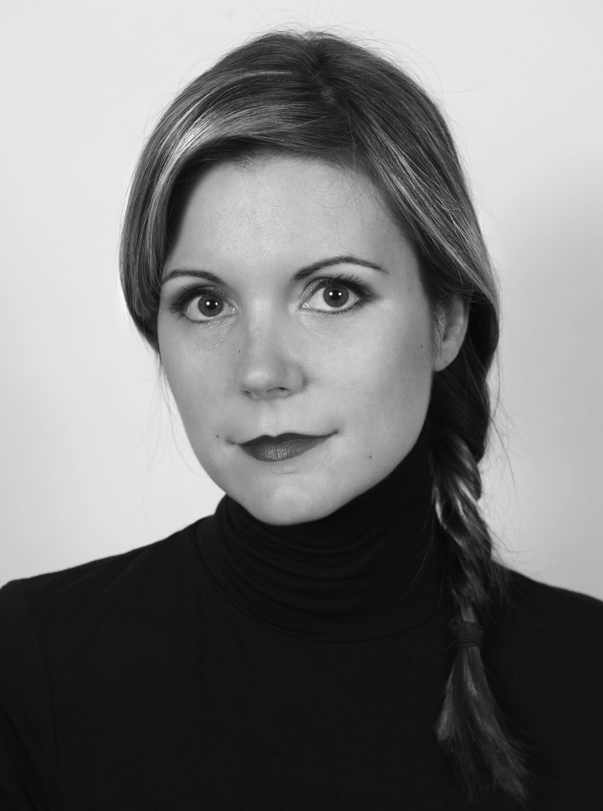
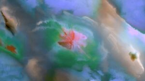
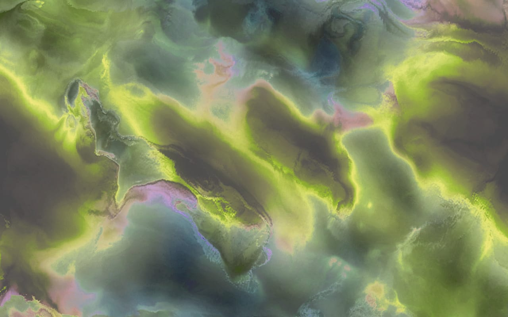
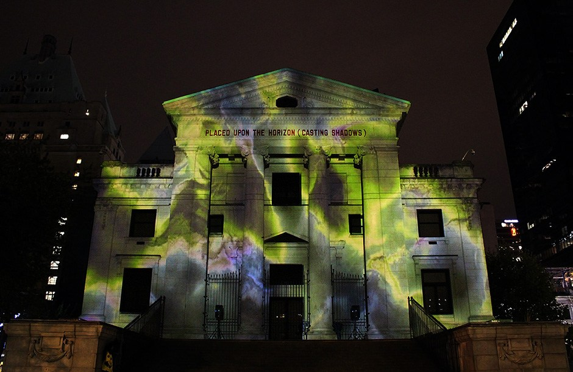

# Persona02-Débora Soto Valenzuela 

investigaciones individuales

## sobre adafruit i/o

### sobre artista, diseñadora o producto que usa electrónica o computación inalámbricas

## Sara Ludy

 

>**"I make art because it's the most natural way for me to understand fundamental aspects of being and what it means to be alive on our planet"**

Sara Ludy es una artista interdisciplinaria estadounidense, combina diferentes medios y técnicas para realizar sus obras, utiliza la pintura digital, realidad virtual,sonido, páginas Web,instalaciones, animación entre otros .

Sara es reconocida por ser una de las figuras más reconocidas en el arte que explora el espacio virtual y nuestra identidad en relación con estos entornos.

Su obra es una mezcla de realidad aumentada y virtual,que busca la  creación de espacios y objetos con manipulación simulada, buscando nuevas formas de interpretar lo inmaterial y fantasmal.Para lograrlo mezcla diferentes medios, cuando le preguntaron sobre porque combinaba diferentes materiales en sus obras respondió:

>"Me gusta acercarme lo más posible a la materia, hasta que algo interesante pasé,lo proceso en distintos programas, lo íntegro en distintos procesos hasta que se transforme en algo más adecuado"

Es por esto que en sus obras fusiona diferentes medios, crea imágenes a partir de objetos 3D, o al revés transformando objetos 3D en pinturas.

Una de sus obras más notables es *"Clouds"* (2011- presente), una serie de animaciones que mediante software crea 
imágenes que simulan fenómenos naturales.

Otra obra notable de Ludy es *"SubSurface Hell"*, para Bitforms Gallery.
en esta instalación se distribuyen en el espacio imágenes personales de la vida cotidiana de Sara, fotos que venía recolectando desde el año 2000 y que tenía guardada en una carpeta con el nombre de *SubSurface Hell*, estás imágenes son reconocibles en forma, pero se desvinculan de sus experiencias y contextos originales.

En la mayoría de sus obras Sara fusiona el uso de el software y el hardware para crear imágenes y animaciones,para simular fenómenos físicos, está artista logra transformar lo que se considera como inerte y frío en algo de aspecto orgánico, los componentes eléctricos pasan a ser parte de sus obras y no solo un medio para realizarlas.

## Fuentes:

https://www.saraludy.com/clouds
https://bitforms.art/artwork/cloud-relief-2
https://www.niio.com/blog/dreams-and-virtual-reality-are-ideal-collaborators-an-interview-with-artist-sara-ludy-by-celine-katzman/
https://officeimpart.com/sara-ludy

