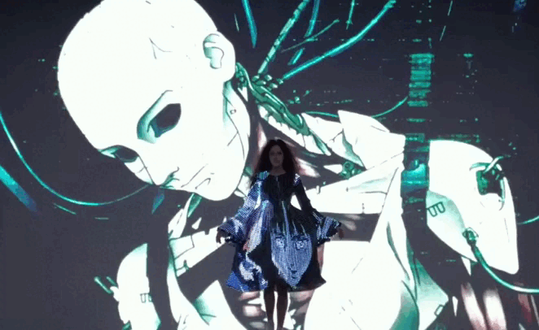

# persona-03 Cristobal Vergara Silva

investigaciones individuales

## sobre adafruit i/o
Adafruit IO es un servicio de nube de Adafruit que permite a los usuarios conectar, monitorear y controlar dispositivos, además de intercambiar datos a través de internet. Es ideal para el aprendizaje porque cuenta con una extensa biblioteca de tutoriales y no requiere escribir código gracias a su firmware WipperSnapper.

Al principio, seguí las indicaciones sobre cómo crearme una cuenta en Adafruit y todo salió bien. Luego, fui a Arduino IDE para ver cómo funcionaba; instalé la biblioteca de Adafruit para intentar con el ejemplo que subieron a GitHub. Lo copié y ahí me salió el primer error: “Compilation error: 'AdafruitIO_WiFi' does not name a type” y “Compilation error: exit status 1”. Después de buscar información, descubrí que el error era que había eliminado el void setup y el void loop. Me puso muy contento que por fin me resultara algo cuando los agregué y funcionó.

Pero entonces vino una segunda complicación: con el Arduino conectado, no me aparecía nada en Port (puerto). Para descartar fallos, primero revisé si tenía instalada la última versión del driver y luego cerré Arduino IDE para probar si no lo reconocía por haberlo conectado con el programa ya abierto (aunque no tenía nada que ver). Después de "intrusear" todos los botones del programa y revisar de nuevo lo instalado, decidí preguntarle a ChatGPT. Estaba algo desconfiado porque no pensé que me ayudaría, pero me dijo que podía deberse a que el cable que estaba usando era solo de carga y no para transferencia de datos. Efectivamente, estaba ocupando el cable de mi celular. Mañana conseguiré otro para descartar esa opción, que me hace mucho sentido.
Efectivamente era el cable, logre correr el código y encender las luces del Arduino.

¡SE LOGRÓ CONECTAR! Vi un sitio de tutoriales en la página de Adafruit y seguí las indicaciones. Aun así no resultaba, hasta que Aaron actualizó el Arduino, que era el gran problema. Luego de eso se conectó sin problemas. Probé con el bloque "Stream" en el Dashboard como decía el ejemplo.

Probando como prender el led desde adafruit, "brickie" el Arduino y Camila nos enseñó a solucionarlo y nos ayudó siguiendo el tutorial que había mandado, conectando un cable con doble hembra al Arduino.

## sobre artista, diseñadora o producto que usa electrónica o computación inalámbricas

## Minoru Fujimoto

**Minoru Fujimoto** es un artista, doctor en filosofía, coreógrafo y doctor en computación vestible de la Universidad de Kobe.
Tras trabajar en el departamento de informática del diseño en la Universidad de Arte de Musashino, fundó MPLUSPLUS (make ++), firma que integra LED en los textiles a través de un sistema de control inalámbrico; según ellos mismos, trabajan con la "sincronización inalámbrica de dispositivos a gran escala y la integración audiovisual precisa hasta la robótica avanzada".

Los ubiqué por la reciente colaboración en la que trabajaron con el diseñador japonés Kunihiko Morinaga, fundador de la marca ANREALAGE, para crear la colección **"2026-27 A/W “GHOST”** en la que de fondo tenía una gran pantalla reproduciendo escenas de Ghost in the Shell, y al mismo tiempo iban pasando prendas programadas para estar coordinadas con la escenografía, para de este modo camuflarse en momentos específicos.
La programación de las prendas tenía "hilos blandos y textiles con 10,000 LED incrustados" con la capacidad de ser plegados y cosidos, en las que el equipo, tras meses desarrollando el sistema de programación, logró que estos LEDs fueran controlables individualmente mediante control remoto, con la capacidad de presentar "imágenes animadas", lo cual llamaron: camuflaje óptico térmico, inspirado en el efecto ficticio del mismo nombre que aparece en el anime Ghost in the Shell.

No es primera vez que Fujimoto (MPLUSPLUS) colabora con Morinaga y con la empresa LED Tokyo, que alquila pantallas LED de gran escala; también realizaron la colección 2025-26 A/W “ SCREEN ” y una colaboración con Beyonce, donde ocupó uno de sus vestidos en su gira Cowboy Carter Tour, en donde Fujimoto también desarrolló textiles LED capaces de mostrar imágenes controladas a distancia.
Si bien la tecnología LED portátil ya había sido abordada por algunas marcas de moda experimental, MPLUSPLUS incorporó sus pantallas en diversos escenarios muy distintos, desde desfiles hasta festivales y conciertos (2022 Stray Kids, MAMA Awards), generando toda una fantasía entre el diálogo del arte y la tecnología.

-----

**Multimedia**

-GIF 1: Extracto de pasarela "GHOST" https://www.youtube.com/watch?v=ELF8gXfzCU0

-GIF 2: Extracto de pasarela "SCREEN" https://www.youtube.com/watch?v=U8_Fa4Cdb_0&t=584s

-GIF 3: Extracto de concierto de Beyonce https://www.youtube.com/shorts/eaKBgUW2G68

**Bibliografia**

-https://mplpl.com/projects/2023-11-02-00

-https://www.lvmhprize.com/en/anrealage

-https://sg.news.yahoo.com/beyonc-anrealage-led-dress-cowboy-220458574.html

-https://www.irkmagazine.com/post/anrealage-fw26-a-retro-future-vision-of-identity/

