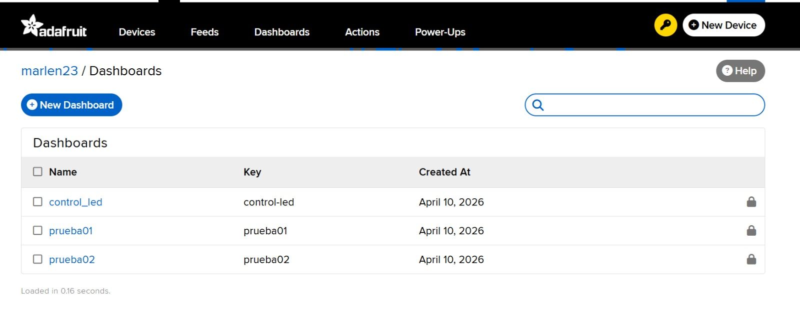

# grupo-09

## integrantes

• Marlén Soto Soto  
• Marcela Zúñiga

## descripción del proyecto

El proyecto consiste en crear un sistema de comunicación entre dispositivos electrónicos utilizando internet mediante la plataforma Adafruit IO. La idea es que los dispositivos puedan enviar y recibir información en tiempo real sin estar conectados físicamente entre sí.

En un inicio, se buscaba controlar un LED de la placa Arduino enviando comandos desde Adafruit (encender y apagar). Sin embargo, esta funcionalidad no se logró implementar correctamente, ya que el Arduino no respondía de forma consistente a los mensajes “ON” y “OFF”.

Por esta razón, se optó por trabajar con el envío y recepción de texto. A través de un feed tipo “text” en Adafruit IO, se logró enviar mensajes desde la plataforma y recibirlos en el Arduino, donde se visualizaron en el monitor serial. De esta manera, se pudo demostrar la comunicación a través de internet, cumpliendo parcialmente el objetivo del proyecto.

## materiales usados en solemne-01

## Materiales

| Material              | Cantidad | Descripción                          | Valor aproximado |
|----------------------|----------|--------------------------------------|------------------|
| Arduino UNO R4 WiFi  | 1        | Placa principal con conectividad WiFi| $30.000 CLP      |
| Cable USB tipo A     | 1        | Conexión entre Arduino y computador  | $3.000 CLP       |

## código usado con Adafruit IO

### código para enviar

Creamos diferentes feeds y dashboards en Adafruit IO, en donde, a base de pruebas y errores, logramos que el Arduino pudiera recibir un mensaje.

El desarrollo del código se basó en ejemplos y documentación oficial de Adafruit IO y Arduino, los cuales fueron adaptados según los requerimientos del proyecto.  




## proceso

El día lunes 06 comenzamos a trabajar en la conexión del sistema con Adafruit IO. Para esto, utilizamos una placa Arduino Uno R4, conectada a un computador mediante un cable USB tipo A-B, el cual permite tanto la alimentación como la comunicación de datos entre el Arduino y el computador. Fuimos de los últimos en lograr establecer la conexión, ya que al principio tuvimos varios problemas relacionados con la velocidad de internet, lo que dificultaba entender en qué parte del proceso estábamos fallando. El sistema quedaba cargando por mucho tiempo y no mostraba información clara.

Con la ayuda de Aaron, probamos cerrar el programa Arduino IDE y volver a abrirlo, lo que permitió reiniciar la conexión. Después de esto, el sistema logró conectarse correctamente, aunque con cierta demora, lo que nos hizo entender que la estabilidad de la red era un factor importante en el funcionamiento del proyecto.

Una vez lograda la conexión, comenzamos a trabajar con el Arduino como receptor de datos enviados desde Adafruit IO. Intentamos implementar un sistema de control utilizando un bloque tipo “toggle” en la plataforma. La idea era que, al cambiar su estado (encendido/apagado), el Arduino recibiera el dato y controlara el LED integrado de la placa. Sin embargo, a pesar de modificar el código en varias ocasiones y revisar la configuración del feed, no logramos que el Arduino respondiera a estos cambios.  


Durante este proceso, identificamos algunos errores en nuestra configuración. Uno de los más relevantes fue que la contraseña del WiFi estaba mal escrita, lo que impedía completamente la conexión. Este error provocaba que el Arduino quedara en un ciclo de intento de conexión, mostrando solo puntos en el monitor serial. Al corregir este detalle, logramos avanzar en la conexión.  


Después de aproximadamente dos horas intentando hacer funcionar el control del LED sin éxito, decidimos cambiar de estrategia. En lugar de trabajar con el toggle, optamos por utilizar un bloque de tipo “text” en Adafruit IO, ya que permitía enviar mensajes de forma más directa.  


A partir de este cambio, adaptamos el código para que el Arduino pudiera recibir y mostrar mensajes enviados desde la plataforma. En esta etapa, Marlen se encargó de enviar los datos desde Adafruit IO, mientras que Marcela trabajó en la recepción desde el Arduino conectado al computador mediante el cable USB. Finalmente, logramos recibir correctamente un mensaje, específicamente “ON”, el cual fue visualizado en el monitor serial.

Intentamos replicar el proceso enviando otros mensajes como “OFF”, pero estos no fueron recibidos correctamente. A pesar de esto, consideramos que el resultado fue positivo, ya que se logró establecer una comunicación básica entre la plataforma y el Arduino.  


<https://github.com/user-attachments/assets/cc8b1825-d7d3-46d0-aa7d-2ac7c3fd2a4d>

Finalmente, observamos que en varias ocasiones la conexión fallaba debido a problemas de internet. En esos casos, era necesario desconectar y volver a conectar el Arduino, además de esperar a que el sistema lograra reconectarse. Esto nos permitió concluir que la conexión a la red es un factor crítico para el correcto funcionamiento de este tipo de proyectos. 

### código para recibir

Para la recepción de datos se utilizó una placa Arduino Uno R4, conectada a un computador mediante un cable USB tipo A-B, el cual permite tanto la alimentación como la comunicación de datos entre el Arduino y el computador.

El Arduino recibe los datos enviados desde Adafruit IO a través de un feed, los cuales son procesados y mostrados en el monitor serial.

```cpp
// Librería para conectar Arduino a Adafruit IO vía WiFi
#include "AdafruitIO_WiFi.h"

// Credenciales de tu red WiFi
#define WIFI_SSID "bla"
#define WIFI_PASS "bla"

// Credenciales de Adafruit IO
#define IO_USERNAME "bla"
#define IO_KEY "bla"

// Crear objeto de conexión
AdafruitIO_WiFi io(IO_USERNAME, IO_KEY, WIFI_SSID, WIFI_PASS);

// Crear feed (canal) llamado "prueba02"
AdafruitIO_Feed *feed = io.feed("prueba02");

// Función que se ejecuta cuando llega un mensaje desde Adafruit
void handleMessage(AdafruitIO_Data *data) {
  // Convertimos el dato recibido a texto
  String mensaje = data->toString();

  // Mostramos el mensaje en el monitor serial
  Serial.print("Mensaje recibido: ");
  Serial.println(mensaje);

  // Si el mensaje es "ON", encendemos el LED
  if (mensaje == "ON") {
    digitalWrite(LED_BUILTIN, HIGH);
  }
  // Si el mensaje es "OFF", apagamos el LED
  else if (mensaje == "OFF") {
    digitalWrite(LED_BUILTIN, LOW);
  }
}

void setup() {
  // Iniciamos comunicación serial
  Serial.begin(115200);

  // Configuramos el LED integrado como salida
  pinMode(LED_BUILTIN, OUTPUT);

  // Conectarse a Adafruit IO
  io.connect();

  // Esperar hasta que se conecte
  while (io.status() < AIO_CONNECTED) {
    Serial.print(".");
    delay(500);
  }

  // Mensaje de conexión exitosa
  Serial.println("\nConectado!");

  // Asociar la función que maneja los mensajes
  feed->onMessage(handleMessage);

  // Pedir el último valor guardado en el feed
  feed->get();
}

void loop() {
  // Mantiene la conexión activa y escucha mensajes
  io.run();

  // Pequeña pausa para estabilidad
  delay(100);  
}
```

## investigaciones individuales

rellenar en el mismo orden que los integrantes del grupo

[Marlen_Soto](./persona-01.md)
[Marcela_Zúñiga](./persona-02.md)
[persona-03.md](./persona-03.md)

## bibliografía

•Adafruit Industries. (s.f.). Adafruit IO Basics: Feeds. Recuperado de <https://learn.adafruit.com/adafruit-io-basics-feeds>

•Adafruit Industries. (s.f.). Adafruit IO Arduino. Recuperado de <https://learn.adafruit.com/adafruit-io/arduino>

•Arduino. (s.f.). Arduino Reference. Recuperado de <https://www.arduino.cc/reference/en/>

•Arduino. (s.f.). WiFi Library. Recuperado de <https://www.arduino.cc/en/Reference/WiFi>

•Adafruit Industries. (s.f.). Adafruit IO Arduino Library. Recuperado de <https://github.com/adafruit/Adafruit_IO_Arduino>
