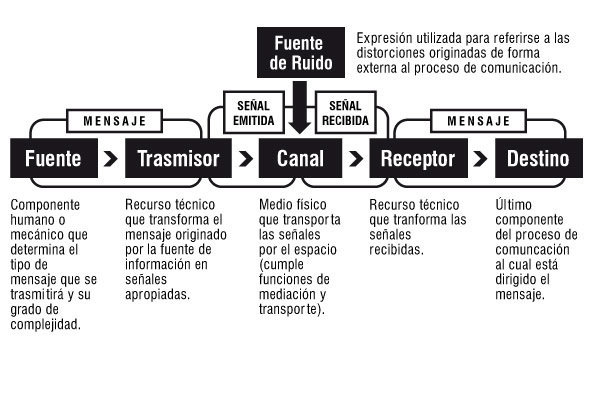

# sesion-04

lunes 30 marzo 2026

La comunicación entre dispositivos se basa en ideas de Claude Shannon, quien desarrolló la teoría de la información. 

Él explicó cómo los datos se pueden transmitir, codificar y recibir entre distintos sistemas sin perder información.

Esto es clave hoy en tecnología, porque permite que dispositivos como Arduino y Raspberry se comuniquen a través de redes (como WiFi) y protocolos como MQTT.  (chatgpt)

 

Es mejor usar un router que compartir internet desde el celular, porque soporta más equipos conectados al mismo tiempo

Datos de la red WiFi:

- red: dis9079

- clave: 75288273

Existen dos tipos de red:

- 2.4 GHz llega más lejos pero es más lenta

- 5 GHz es más rápida pero cubre menos distancia

La Raspberry Pi tiene una dirección fija, lo que facilita conectarse siempre al mismo lugar

En este caso actúa como el punto central donde llegan los datos 

Se puede acceder de forma remota usando SSH

TigerVNC permite ver y controlar la Raspberry desde otro dispositivo

El comando sudo permite ejecutar acciones con permisos más altos dentro del sistema

MQTT es el sistema que se usa para enviar y recibir información entre dispositivos usando internet

Funciona a través del puerto 1883

Para conectarse se necesita un identificador y una contraseña

Todos los dispositivos deben usar el mismo topic para poder intercambiar datos

En el Arduino hay que configurar el nombre del grupo y usar la misma clave entre todos

El término “bug” se usa para errores y viene de un caso real con un insecto en un computador
