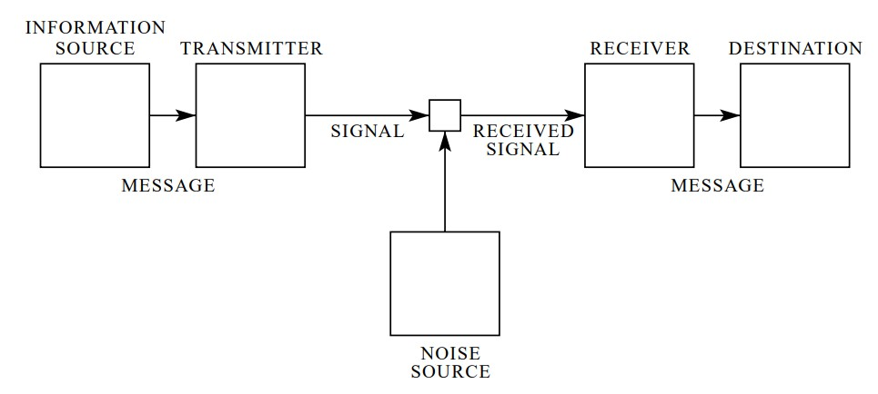

# sesion-04

lunes 30 marzo 2026

# TigerVNC

## Qué es?

implementación de alto rendimiento, de código abierto y multiplataforma del protocolo VNC (Virtual Network Computing). Permite a los usuarios conectarse remotamente a un servidor gráfico.

# Topic mqtt

## Mosquitto -v (dime todo)

Claude Shannon -> La teoría de la información

.

## Wifi Web Server Led Blink 

# SOLEMNE 1

## Ejercicios y pruebas en grupo amistad es amigo <3 

Pulso sensor A5 -> Negative CND -> A0

conection -> luz

lo logramos yeeeei

