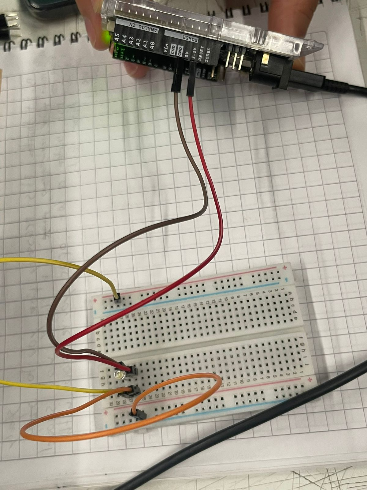

# sesion-05

lunes 06 abril 2026

La clase de hoy fue mas de investiar sobre las interacciones que queremos experimentar en nuestras solemnes, partiendo la clase logrando conectar nuestro Arduino a la nube de Adafruit IO, luego decidimos seguir investigando sobre como conectar y controlar un LED desde Arduino y de intermediario el Feed de Adafruit IO que es donde se realiza la conexionon y el Dashboard que es donde se puede manipular las interacciones como apagar y encender o contar datos.
leimos y seguimos un tutorial de Adafruit para eso pero no lo logramos hacer.

https://learn.adafruit.com/adafruit-io-basics-esp8266-arduino/example-sketches

aun asi fuimos por 1 pin LED, hartos cables y 1 OHM's resistor de 220.
Comenzamos a hacer las conexiones con ayuda de algunos compañeros que nos fueron orientando en como ir poniendo los componentes entre el arduino y la protoboard, y logramos hacer que se prendiera la luz pero se quedaba estatica solamente, y hasta ahi llegamos durante la jornada

